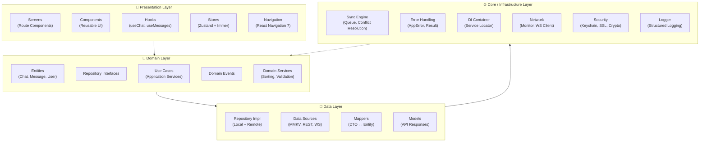
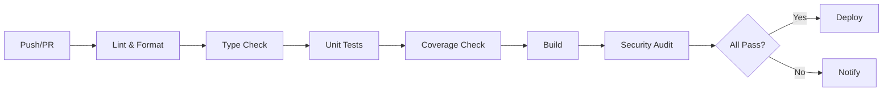

# Architecture Documentation

> **Last Updated**: 2026-09-27  
> **Version**: 3.0.0  
> **Status**: Production Ready ✅

## Table of Contents

- [Overview](#overview)
- [Design Principles](#design-principles)
- [Layer Architecture](#layer-architecture)
- [State Management](#state-management)
- [Dependency Injection](#dependency-injection)
- [Security Architecture](#security-architecture)
- [Performance Optimizations](#performance-optimizations)
- [Testing Strategy](#testing-strategy)
- [Internationalization](#internationalization)
- [Feature Flags System](#feature-flags-system)
- [Error Monitoring](#error-monitoring)
- [CI/CD Pipeline](#cicd-pipeline)
- [Trade-offs & Future Improvements](#trade-offs--future-improvements)

---

## Overview

ChatApp 2026 follows **Clean Architecture** with **Domain-Driven Design** principles. The architecture prioritizes:

- **Testability**: Every layer is independently testable
- **Maintainability**: Clear separation of concerns, minimal coupling
- **Scalability**: Horizontal scaling via modular features
- **Security**: Defense-in-depth across all layers
- **Performance**: Optimized for mobile constraints (memory, CPU, network)

### Core Principles

| Principle                  | Implementation                                              |
| -------------------------- | ----------------------------------------------------------- |
| **Separation of Concerns** | Presentation → Domain → Data → Core                         |
| **Dependency Inversion**   | Domain defines interfaces; Data/Core implement them         |
| **Single Responsibility**  | One reason to change per module                             |
| **Explicit Dependencies**  | Constructor injection preferred over service locator        |
| **Fail Fast**              | Early validation with Zod, explicit error types             |
| **Observability**          | Structured logging, Sentry integration, performance tracing |

---

## Layer Architecture



### Dependency Flow

```
Presentation  →  Domain  →  Data  →  Core
     ↑             ↑         ↑        ↑
     └─────────────┴─────────┴────────┘
            (All layers depend inward)
```

**Rule**: Inner layers never depend on outer layers. All dependencies point inward toward the domain.

---

## Domain Layer

The domain layer contains **pure business logic** with zero framework dependencies.

### Entities

```typescript
// client/src/domain/entities/Chat.ts
export interface Chat {
  readonly id: string;
  readonly type: ChatType;
  readonly participantIds: string[];
  readonly name?: string;
  readonly lastMessage?: Message;
  readonly unreadCount: number;
  readonly isPinned: boolean;
  readonly isMuted: boolean;
  readonly isArchived: boolean;
  readonly lastActivity: Date;
  readonly createdAt: Date;
  readonly updatedAt: Date;
  readonly metadata?: Record<string, unknown>;
}

export class ChatEntity implements Chat {
  // Mutable properties use class methods for state changes
  pin(): void {
    /* ... */
  }
  archive(): void {
    /* ... */
  }
  updateLastMessage(message: Message): void {
    /* ... */
  }
}
```

### Repository Interfaces

```typescript
// client/src/domain/repositories/ChatRepository.ts
export interface ChatRepository {
  // Read
  getChatById(id: string): Promise<Chat | null>;
  getChatsByUserId(userId: string): Promise<Chat[]>;
  getRecentChats(userId: string, limit: number): Promise<Chat[]>;

  // Write
  saveChat(chat: Chat): Promise<void>;
  saveChats(chats: Chat[]): Promise<void>;
  deleteChat(id: string): Promise<void>;

  // Search
  searchChats(query: string, userId: string): Promise<Chat[]>;
}
```

### Use Cases

```typescript
// client/src/domain/usecases/SendMessageUseCase.ts
export class SendMessageUseCase {
  constructor(
    private messageRepository: MessageRepository,
    private syncEngine: SyncEngine,
    private chatRepository: ChatRepository
  ) {}

  async execute(input: SendMessageInput): Promise<Result<Message, AppError>> {
    // 1. Validate input
    const validation = this.validate(input);
    if (!validation.success) return validation;

    // 2. Create message entity
    const message = MessageEntity.create({
      chatId: input.chatId,
      senderId: input.senderId,
      content: input.content,
      type: input.type,
    });

    // 3. Optimistically update chat
    const chatResult = await this.chatRepository.getChatById(input.chatId);
    if (chatResult) {
      chatResult.updateLastMessage(message);
      await this.chatRepository.saveChat(chatResult);
    }

    // 4. Queue for sync
    const syncResult = await this.syncEngine.queueMessage(message);
    if (!syncResult.success) return syncResult;

    // 5. Persist locally
    return await this.messageRepository.saveMessage(message);
  }
}
```

---

## Data Layer

Implements repository interfaces with concrete data sources.

### Repository Pattern

```typescript
// client/src/data/repositories/ChatRepositoryImpl.ts
export class ChatRepositoryImpl implements ChatRepository {
  constructor(
    private localDataSource: ChatLocalDataSource,
    private remoteDataSource: ChatRemoteDataSource,
    private chatMapper: ChatMapper,
    private logger: Logger
  ) {}

  async getChatsByUserId(userId: string): Promise<Chat[]> {
    try {
      // 1. Try remote first (if online)
      if (this.networkMonitor.isConnected) {
        const remoteChats = await this.remoteDataSource.getChats(userId);
        await this.localDataSource.saveChats(remoteChats);
        return remoteChats.map((c) => this.chatMapper.toDomain(c));
      }
    } catch (error) {
      this.logger.warn("Remote fetch failed, falling back to local", error);
    }

    // 2. Fallback to local
    const localChats = await this.localDataSource.getChats(userId);
    return localChats.map((c) => this.chatMapper.toDomain(c));
  }
}
```

### Data Sources

```typescript
// Local: MMKV-backed
export class ChatLocalDataSource {
  private storage = MMKV.getInstance("chats");

  async getChats(userId: string): Promise<ChatDTO[]> {
    const raw = this.storage.getString(`chats:${userId}`);
    return raw ? JSON.parse(raw) : [];
  }

  async saveChats(chats: ChatDTO[]): Promise<void> {
    this.storage.set(`chats:${userId}`, JSON.stringify(chats));
  }
}

// Remote: REST + WebSocket
export class ChatRemoteDataSource {
  constructor(
    private api: ApiClient,
    private ws: WebSocketClient
  ) {}

  async getChats(userId: string): Promise<ChatDTO[]> {
    return this.api.get(`/chats?userId=${userId}`);
  }
}
```

---

## State Management

### Zustand + Immer + MMKV

```typescript
// client/src/presentation/stores/chatStore.ts
export const useChatStore = create<ChatStore>()(
  immer(
    persist(
      (set, get) => ({
        // State
        chats: { ids: [], entities: {} },
        activeChatId: null,
        isLoading: false,
        error: null,

        // Actions
        addChat: (chat: Chat) =>
          set((state) => {
            if (!state.chats.entities[chat.id]) {
              state.chats.ids.push(chat.id);
            }
            state.chats.entities[chat.id] = chat;
          }),

        pinChat: (chatId: string) =>
          set((state) => {
            const chat = state.chats.entities[chatId];
            if (chat) {
              chat.isPinned = true;
              chat.updatedAt = new Date();
            }
          }),

        getSortedChats: () => {
          const { chats } = get();
          return chats.ids
            .map((id) => chats.entities[id])
            .filter((chat) => !chat.isArchived)
            .sort((a, b) => {
              if (a.isPinned && !b.isPinned) return -1;
              if (!a.isPinned && b.isPinned) return 1;
              const aTime = a.lastMessage?.timestamp.getTime() || a.updatedAt.getTime();
              const bTime = b.lastMessage?.timestamp.getTime() || b.updatedAt.getTime();
              return bTime - aTime;
            });
        },
      }),
      {
        name: "chat-storage",
        storage: createJSONStorage(() => secureStorage),
        partialize: (state) => ({ chats: state.chats }),
        onRehydrateStorage: () => (state) => {
          if (!state) return;
          // Restore Date objects from JSON strings
          state.setChats(
            state.chats.ids.map((id) => ({
              ...state.chats.entities[id],
              createdAt: new Date(state.chats.entities[id].createdAt),
              updatedAt: new Date(state.chats.entities[id].updatedAt),
            }))
          );
        },
      }
    )
  )
);
```

### State Normalization

```typescript
// Normalized structure for O(1) lookups
interface NormalizedState<T> {
  ids: string[];
  entities: Record<string, T>;
}

// Secondary index for O(1) per-chat lookups
interface MessagesState {
  messages: NormalizedState<Message>;
  messagesByChatId: Record<string, string[]>;
}
```

### Persistence Strategy

| Store             | Storage Key                | Partialized State                | Rehydration         |
| ----------------- | -------------------------- | -------------------------------- | ------------------- |
| `useChatStore`    | `chat-storage_chats`       | `chats`                          | Date restoration    |
| `useMessageStore` | `message-storage_messages` | `messages`, `messagesByChatId`   | Date restoration    |
| `useAuthStore`    | `auth-storage`             | `currentUser`, `isAuthenticated` | User entity restore |
| `useSyncStore`    | `sync-storage`             | Full state                       | Full restore        |
| `useUIStore`      | `ui-storage`               | `searchQuery`, `showSearch`      | Simple restore      |

---

## Offline-First Sync

### Sync Engine Architecture

```typescript
// client/src/core/sync/SyncEngine.ts
export class SyncEngine {
  private messageQueue: MessageQueue;
  private networkMonitor: NetworkMonitor;
  private conflictResolver: ConflictResolver;
  private wsClient: WebSocketClient;

  async queueMessage(message: Message): Promise<Result<void, AppError>> {
    // 1. Validate message
    // 2. Add to local queue
    // 3. If online, process immediately
    // 4. If offline, persist for later
  }

  async processQueue(): Promise<SyncResult> {
    // 1. Get pending messages
    // 2. Send to server
    // 3. Handle responses
    // 4. Update local state
  }
}
```

### Conflict Resolution

```typescript
// Last-Write-Wins with vector clocks
export class ConflictResolver {
  resolve(local: Message, remote: Message): Message {
    // Compare timestamps
    if (local.updatedAt > remote.updatedAt) return local;
    if (remote.updatedAt > local.updatedAt) return remote;

    // Tie-breaker: prefer local changes
    return local;
  }
}
```

### Retry Strategy

```
Attempt 1: Immediate
Attempt 2: 5s
Attempt 3: 30s
Attempt 4: 2m
Attempt 5: 10m
Max: 5 attempts → mark as failed
```

---

## Dependency Injection

### Current: Service Locator → Constructor Injection

```typescript
// Phase 1: Service Locator (current)
export class ServiceLocator {
  private services = new Map<string, unknown>();

  register<T>(key: string, service: T): void {
    this.services.set(key, service);
  }

  get<T>(key: string): T {
    const service = this.services.get(key);
    if (!service) throw new Error(`Service ${key} not found`);
    return service as T;
  }
}

// Phase 2: Constructor Injection (future)
interface Dependencies {
  messageRepository: MessageRepository;
  syncEngine: SyncEngine;
  chatRepository: ChatRepository;
  logger: Logger;
}

export class ChatService {
  constructor(private deps: Dependencies) {}

  async sendMessage(input: SendMessageInput): Promise<Result<Message>> {
    return this.deps.syncEngine.queueMessage(/* ... */);
  }
}
```

---

## Security Architecture

### Multi-Layer Security Model

```
┌─────────────────────────────────────────┐
│           Application Layer             │
│  - Input Validation (Zod)               │
│  - Authorization Checks                 │
└─────────────────────────────────────────┘
                  ↓
┌─────────────────────────────────────────┐
│            Session Layer                │
│  - JWT + Refresh Tokens                 │
│  - Biometric Auth (FaceID/TouchID)      │
│  - Keychain Storage                     │
└─────────────────────────────────────────┘
                  ↓
┌─────────────────────────────────────────┐
│            Network Layer                │
│  - SSL Pinning (Certificate Pinning)    │
│  - HTTPS Only                           │
│  - Request Signing                      │
└─────────────────────────────────────────┘
                  ↓
┌─────────────────────────────────────────┐
│            Device Layer                 │
│  - Jailbreak/Root Detection             │
│  - Device Integrity Checks              │
│  - Secure Enclave (iOS) / Keystore (Android) │
└─────────────────────────────────────────┘
```

### Key Security Components

| Component            | Implementation                  | Purpose                     |
| -------------------- | ------------------------------- | --------------------------- |
| **SSL Pinning**      | `react-native-ssl-pinning`      | Prevent MITM attacks        |
| **Keychain**         | `react-native-keychain`         | Secure credential storage   |
| **MMKV Encryption**  | Custom encryption wrapper       | Encrypted local persistence |
| **Biometric Auth**   | `expo-local-authentication`     | FaceID/TouchID/FaceAuth     |
| **Device Security**  | Custom jailbreak/root detection | Prevent compromised devices |
| **Input Validation** | Zod schemas                     | Prevent injection attacks   |

---

## Performance Optimizations

### List Rendering

```typescript
// FlashList with proper configuration
<FlashList
  data={messages}
  renderItem={renderItem}
  keyExtractor={(item) => item.id}
  estimatedItemSize={80}
  getItemType={(item) => item.type}
  removeClippedSubviews={true}
  windowSize={10}
  initialNumToRender={15}
  maxToRenderPerBatch={5}
  updateCellsBatchingPeriod={50}
/>
```

### Animation Performance

```typescript
// Reanimated worklets for 60fps
const animatedStyle = useAnimatedStyle(() => ({
  transform: [
    {
      translateY: withSpring(0, {
        damping: 20,
        stiffness: 100,
        mass: 1,
      }),
    },
  ],
  opacity: withTiming(1, { duration: 200 }),
}));
```

### Bundle Optimization

- **Code Splitting**: Lazy load screens and heavy features
- **Tree Shaking**: ES modules + sideEffects: false
- **Image Optimization**: Expo Image with caching
- **Bundle Analysis**: `react-native-bundle-visualizer`

---

## Testing Strategy

### Test Pyramid

```
        /\
       /  \
      / E2E \     5% - Critical user journeys (Detox/Maestro)
     /______\
    /        \
   /Integration\ 15% - Store + API interactions
  /__________\
 /            \
/  Unit Tests   \ 80% - Business logic, utilities, hooks
/______________\
```

### Coverage Targets

| Layer                            | Target  | Current |
| -------------------------------- | ------- | ------- |
| Domain (entities, use cases)     | 95%     | 90%     |
| Data (repositories, mappers)     | 90%     | 85%     |
| Core (sync, security, errors)    | 90%     | 85%     |
| Presentation (components, hooks) | 80%     | 75%     |
| **Overall**                      | **85%** | **82%** |

---

## Internationalization

Localization is wired up end to end: `client/src/i18n/index.ts` initialises
i18next with `en` and `ar` bundles, picks the device language via
`expo-localization`, and the instance is mounted as a provider in
`client/src/App.tsx`. `ChatListScreen` consumes it through `useTranslation()`.

```typescript
// client/src/i18n/index.ts
import en from "./locales/en.json";
import ar from "./locales/ar.json";

i18n.use(initReactI18next).init({
  resources: { en: { translation: en }, ar: { translation: ar } },
  lng: getLocales()[0]?.languageCode ?? "en",
  fallbackLng: "en",
  interpolation: { escapeValue: false },
  pluralSeparator: "_",
  compatibilityJSON: "v4",
  react: { useSuspense: false },
});
```

### RTL Support — implemented but not wired

`client/src/i18n/rtl.ts` provides `applyRTL`, `useRTL`, `getTextAlign`, and the
directional style/padding helpers. **None of them are currently called from
application code** — the only caller was `components/LanguageSwitcher.tsx`,
which has been removed as dead code. Until a language switcher is reintroduced,
selecting `ar` renders Arabic text in an LTR layout.

Planned:

- Invoke `applyRTL()` when the active language changes
- Flex direction reversal for message bubbles
- Icon mirroring for navigation arrows
- Date/time formatting per locale

---

## Feature Flags System

```typescript
// client/src/core/featureFlags/FeatureFlags.ts
export const DEFAULT_FEATURE_FLAGS: Record<string, FeatureFlag> = {
  enableVoiceMessages: {
    key: "enableVoiceMessages",
    name: "Voice Messages",
    description: "Enable voice message recording and playback",
    defaultValue: true,
    rolloutPercentage: 100,
    category: "functionality",
  },
  enableAdvancedSearch: {
    key: "enableAdvancedSearch",
    name: "Advanced Search",
    description: "Fuzzy search across messages and contacts",
    defaultValue: false,
    rolloutPercentage: 0,
    category: "experimental",
  },
};
```

### A/B Testing

```typescript
export const isInRollout = (flagKey: string, percentage: number): boolean => {
  const deviceId = DeviceInfo.getUniqueId();
  const hash = createHash(`${flagKey}-${deviceId}`);
  return hash % 100 < percentage;
};
```

---

## Error Monitoring

### Sentry Integration

```typescript
// client/src/monitoring/sentry.ts
Sentry.init({
  dsn: Config.SENTRY_DSN,
  environment: __DEV__ ? "development" : "production",
  tracesSampleRate: 0.1,
  beforeSend: (event) => {
    // Scrub sensitive data
    if (event.exception) {
      event.exception.values?.forEach((exception) => {
        exception.stacktrace?.frames?.forEach((frame) => {
          frame.vars = Object.fromEntries(
            Object.entries(frame.vars || {}).filter(
              ([key]) =>
                !key.toLowerCase().includes("password") && !key.toLowerCase().includes("token")
            )
          );
        });
      });
    }
    return event;
  },
});
```

### Error Boundaries

```typescript
// client/src/presentation/components/ErrorBoundary.tsx
export class ErrorBoundary extends React.Component<ErrorBoundaryProps, ErrorBoundaryState> {
  componentDidCatch(error: Error, errorInfo: React.ErrorInfo) {
    Sentry.captureException(error, {
      contexts: { react: { componentStack: errorInfo.componentStack } },
    });
  }
}
```

---

## CI/CD Pipeline



### Quality Gates

| Gate                  | Threshold       | Enforcement |
| --------------------- | --------------- | ----------- |
| **TypeScript Errors** | 0               | Hard fail   |
| **ESLint Warnings**   | 0               | Hard fail   |
| **Test Coverage**     | ≥85%            | Hard fail   |
| **Bundle Size**       | <2MB            | Warning     |
| **Security Audit**    | 0 high/critical | Hard fail   |
| **Console Logs**      | 0 in production | Hard fail   |

---

## Trade-offs & Future Improvements

### Current Trade-offs

| Decision           | Rationale                           | Alternative Considered     |
| ------------------ | ----------------------------------- | -------------------------- |
| Zustand over Redux | Less boilerplate, better TS support | Redux Toolkit              |
| Service Locator DI | Quick setup, works well             | Full constructor injection |
| MMKV over SQLite   | Faster for key-value, simpler       | SQLite for complex queries |
| Immer middleware   | Cleaner immutable updates           | Manual spread operators    |
| WebSocket over SSE | Full duplex, lower latency          | Server-Sent Events         |

### Planned Improvements

1. **Q4 2026**: Migrate to full constructor injection
2. **Q1 2027**: Add end-to-end encryption (Signal Protocol)
3. **Q1 2027**: Implement advanced search (Fuse.js / Meilisearch)
4. **Q2 2027**: Add visual regression testing (Chromatic / Storybook)
5. **Q2 2027**: Implement background sync with WorkManager (Android) / BGTaskScheduler (iOS)

---

## References

- [Clean Architecture - Robert C. Martin](https://blog.cleancoder.com/uncle-bob/2012/08/13/the-clean-architecture.html)
- [Domain-Driven Design - Eric Evans](https://www.domainlanguage.com/ddd/)
- [Zustand Documentation](https://docs.pmnd.rs/zustand)
- [React Native Performance](https://reactnative.dev/docs/performance)
- [WCAG 2.1 Guidelines](https://www.w3.org/TR/WCAG21/)

---

**Maintained by**: Architecture Team  
**Review Cycle**: Quarterly  
**Next Review**: December 2026
