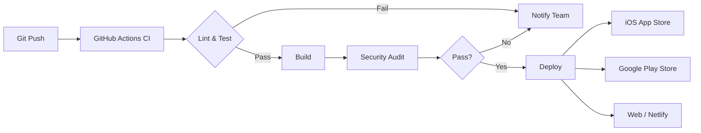

# Deployment Guide

> **Version**: 3.0.1  
> **Last Updated**: 2026-10-07  
> **Status**: Active Development — not production ready

## Table of Contents

- [Overview](#overview)
- [Prerequisites](#prerequisites)
- [Environment Configuration](#environment-configuration)
- [Production Readiness Checklist](#production-readiness-checklist)
- [Build Process](#build-process)
- [Deployment Pipelines](#deployment-pipelines)
- [Platform-Specific Deployment](#platform-specific-deployment)
- [Monitoring & Observability](#monitoring--observability)
- [Rollback Procedures](#rollback-procedures)
- [Troubleshooting](#troubleshooting)
- [Maintenance](#maintenance)

---

## Overview

This guide covers the complete deployment process for ChatApp 2026 across **iOS**, **Android**, and **Web** platforms. The deployment pipeline uses **GitHub Actions** for CI/CD and **EAS Build** for mobile app builds.

### Deployment Architecture



### Deployment Environments

| Environment     | Purpose                | URL                   | Branch        |
| --------------- | ---------------------- | --------------------- | ------------- |
| **Development** | Local development      | `localhost:8081`      | `main`        |
| **Staging**     | Pre-production testing | `staging.chatapp.com` | `staging`     |
| **Production**  | Live app               | `chatapp.com`         | `main` (tags) |

---

## Prerequisites

### Required Accounts

| Service                 | Purpose                | Sign Up                                                    |
| ----------------------- | ---------------------- | ---------------------------------------------------------- |
| **Expo**                | EAS Build, OTA updates | [expo.dev](https://expo.dev)                               |
| **Apple Developer**     | iOS app signing        | [developer.apple.com](https://developer.apple.com)         |
| **Google Play Console** | Android app signing    | [play.google.com/console](https://play.google.com/console) |
| **Sentry**              | Error tracking         | [sentry.io](https://sentry.io)                             |
| **Netlify/Vercel**      | Web hosting            | [netlify.com](https://netlify.com)                         |
| **GitHub**              | CI/CD, repository      | [github.com](https://github.com)                           |

### Required Secrets

Set these in **GitHub Repository Secrets** (`Settings → Secrets and variables → Actions`):

```bash
# Expo / EAS
EXPO_TOKEN=your-expo-token-here

# Sentry
SENTRY_AUTH_TOKEN=your-sentry-auth-token
SENTRY_ORG=your-sentry-org
SENTRY_PROJECT=your-sentry-project

# Apple (for iOS signing)
APPLE_ID=your-apple-id@example.com
APPLE_ID_PASSWORD=your-app-specific-password
APPLE_TEAM_ID=your-team-id

# Google (for Android signing)
GOOGLE_PLAY_SERVICE_ACCOUNT_JSON=your-service-account-json

# Web Deployment
NETLIFY_AUTH_TOKEN=your-netlify-token
NETLIFY_SITE_ID=your-site-id

# API Keys
API_BASE_URL=https://api.chatapp.com
SENTRY_DSN=https://your-sentry-dsn@sentry.io/project-id
```

---

## Environment Configuration

### Environment Files

```env
# .env.example (commit this)
EXPO_PUBLIC_DOMAIN=api.chatapp.com      # REQUIRED — query-client.ts throws without it
EXPO_PUBLIC_API_URL=https://api.chatapp.com
EXPO_PUBLIC_WS_URL=wss://api.chatapp.com/ws
EXPO_PUBLIC_APP_NAME=ChatApp
EXPO_PUBLIC_VERSION=3.0.0
EXPO_PUBLIC_BUILD_NUMBER=1
EXPO_PUBLIC_SENTRY_DSN=https://your-sentry-dsn@sentry.io/project-id
# NOT read by any code — kept here only to avoid confusion if found in old envs:
#   EXPO_PUBLIC_ENABLE_FEATURE_FLAGS, EXPO_PUBLIC_DEV_MODE
# Feature flags are hardcoded in client/src/stores/featureFlagsStore.ts
# iOS/Android production builds only. Web relies on browser-enforced HTTPS.
# Must be a real, comma-separated `sha256/<43-char base64>` pin. Leave it empty
# in `.env.example` so an unconfigured build fails fast instead of shipping an
# unmatchable pin that breaks every request at runtime.
EXPO_PUBLIC_CERT_HASHES=
```

`npm run validate:env` rejects `EXPO_PUBLIC_CERT_HASHES` that is empty, not a
`sha256/` + 44-character base64 digest, or matches the documented placeholder, so
a template copy cannot reach a native release.

Generate the pins from the live backend certificate:

```bash
openssl s_client -connect api.chatapp.com:443 -servername api.chatapp.com </dev/null 2>/dev/null \
  | openssl x509 -pubkey -noout \
  | openssl pkey -pubin -outform der \
  | openssl dgst -sha256 -binary \
  | openssl enc -base64
```

Prepend `sha256/` and comma-separate multiple pins so a certificate rotation
does not brick released clients. On web, `react-native-ssl-pinning` has no
native module, so pinning is skipped and the browser validates the certificate
chain instead.

### Environment Validation

```bash
# Validate environment variables
npm run validate:env

# This checks:
# - All required variables are set
# - No placeholder values remain
# - URLs are valid
# - Version numbers follow semver
```

---

## Production Readiness Checklist

### ✅ Code Quality

- [ ] **TypeScript**: Zero type errors (`npm run type-check`)
- [ ] **ESLint**: Zero warnings (`npm run lint`)
- [ ] **Prettier**: Code formatted (`npm run format:check`)
- [ ] **Tests**: 61.2% coverage (target ≥85%) (`npm run test:coverage`)
- [ ] **ESLint**: 22 warnings (target 0) (`npm run lint`)
- [ ] **Console Logs**: No `console.log` in production code (`npm run check:console`)
- [ ] **Bundle Size**: < 2MB (`npm run bundle:analyze`)

### ✅ Security

- [ ] **Dependencies**: 54 high vulnerabilities (toolchain advisories accepted as RA-004/RA-005) (`npm audit`)
- [ ] **SSL Pinning**: Certificates configured and tested
- [ ] **Keychain**: Sensitive data stored securely
- [ ] **Input Validation**: All inputs validated with Zod
- [ ] **Environment**: No secrets in bundle or source control

### ✅ Performance

- [ ] **Startup Time**: < 3 seconds cold start
- [ ] **Memory**: < 150MB peak usage
- [ ] **List Rendering**: FlashList implemented for long lists
- [ ] **Animations**: 60fps on mid-range devices
- [ ] **Network**: Efficient retry logic, no memory leaks

### ✅ Accessibility

- [ ] **WCAG 2.1 AA**: All components tested
- [ ] **Screen Reader**: VoiceOver/TalkBack verified
- [ ] **Touch Targets**: Minimum 44×44pt / 48×48dp
- [ ] **Color Contrast**: 4.5:1 minimum verified
- [ ] **RTL**: Arabic/Hebrew layouts tested

### ✅ Platform Compliance

- [ ] **iOS**: App Store guidelines met, no private APIs
- [ ] **Android**: Play Store policies met, target SDK 34+
- [ ] **Web**: PWA manifest, SEO meta tags, Lighthouse 90+

---

## Build Process

### EAS Build Configuration

```json
// eas.json
{
  "cli": {
    "version": ">= 3.0.0"
  },
  "build": {
    "development": {
      "developmentClient": true,
      "distribution": "internal",
      "ios": {
        "simulator": true
      }
    },
    "preview": {
      "distribution": "internal",
      "ios": {
        "simulator": false
      },
      "android": {
        "buildType": "apk"
      }
    },
    "production": {
      "ios": {
        "autoIncrement": "build-number",
        "resourceClass": "m-medium"
      },
      "android": {
        "buildType": "app-bundle",
        "autoIncrement": "buildNumber"
      }
    }
  },
  "submit": {
    "production": {
      "ios": {
        "appleId": "your-apple-id@example.com",
        "appleTeamId": "your-team-id",
        "ascAppId": "1234567890"
      },
      "android": {
        "serviceAccountKeyPath": "./google-play-service-account.json",
        "track": "production"
      }
    }
  }
}
```

### Build Commands

```bash
# Development build (simulator/emulator)
eas build --platform ios --profile development
eas build --platform android --profile development

# Preview build (internal testing)
eas build --platform ios --profile preview
eas build --platform android --profile preview

# Production build (App Store / Play Store)
eas build --platform ios --profile production
eas build --platform android --profile production
```

---

## Deployment Pipelines

### GitHub Actions Workflow

```yaml
# .github/workflows/deploy.yml
name: Deploy

on:
  push:
    tags:
      - "v*"

jobs:
  quality:
    runs-on: ubuntu-latest
    steps:
      - uses: actions/checkout@v4
      - uses: actions/setup-node@v4
        with:
          node-version: 18
          cache: "npm"
      - run: npm install
      - run: npm run validate
      - run: npm run type-check
      - run: npm run lint
      - run: npm test -- --coverage

  build:
    needs: quality
    runs-on: ubuntu-latest
    steps:
      - uses: actions/checkout@v4
      - uses: actions/setup-node@v4
        with:
          node-version: 18
          cache: "npm"
      - run: npm install
      - run: npm run build:web

  deploy-web:
    needs: build
    runs-on: ubuntu-latest
    steps:
      - uses: actions/checkout@v4
      - uses: netlify/actions/cli@master
        with:
          args: deploy --dir=dist --prod
        env:
          NETLIFY_AUTH_TOKEN: ${{ secrets.NETLIFY_AUTH_TOKEN }}
          NETLIFY_SITE_ID: ${{ secrets.NETLIFY_SITE_ID }}

  build-ios:
    needs: quality
    runs-on: ubuntu-latest
    steps:
      - uses: actions/checkout@v4
      - uses: expo/expo-github-action@v8
        with:
          eas-version: latest
          token: ${{ secrets.EXPO_TOKEN }}
        env:
          APPLE_ID: ${{ secrets.APPLE_ID }}
          APPLE_ID_PASSWORD: ${{ secrets.APPLE_ID_PASSWORD }}

  submit-ios:
    needs: build-ios
    runs-on: ubuntu-latest
    steps:
      - uses: actions/checkout@v4
      - uses: expo/expo-github-action@v8
        with:
          eas-version: latest
          token: ${{ secrets.EXPO_TOKEN }}
        env:
          APPLE_ID: ${{ secrets.APPLE_ID }}
          APPLE_ID_PASSWORD: ${{ secrets.APPLE_ID_PASSWORD }}

  build-android:
    needs: quality
    runs-on: ubuntu-latest
    steps:
      - uses: actions/checkout@v4
      - uses: expo/expo-github-action@v8
        with:
          eas-version: latest
          token: ${{ secrets.EXPO_TOKEN }}

  submit-android:
    needs: build-android
    runs-on: ubuntu-latest
    steps:
      - uses: actions/checkout@v4
      - uses: expo/expo-github-action@v8
        with:
          eas-version: latest
          token: ${{ secrets.EXPO_TOKEN }}
        env:
          GOOGLE_PLAY_SERVICE_ACCOUNT_JSON: ${{ secrets.GOOGLE_PLAY_SERVICE_ACCOUNT_JSON }}
```

---

## Platform-Specific Deployment

### iOS App Store

#### Requirements

- Apple Developer Account ($99/year)
- App Store Connect access
- Valid signing certificates
- Provisioning profiles

#### Submission Checklist

- [ ] **App Metadata**:
  - [ ] App name: "ChatApp 2026"
  - [ ] Category: Social Networking
  - [ ] Age rating: 12+ (messaging app)
  - [ ] Privacy Policy URL
  - [ ] Support URL
  - [ ] Marketing URL (optional)

- [ ] **Assets**:
  - [ ] App icon (1024×1024 PNG)
  - [ ] Screenshots (all device sizes)
  - [ ] App preview videos (optional)

- [ ] **Build Settings**:
  - [ ] Bundle identifier: `com.chatapp.app`
  - [ ] Version: `3.0.0`
  - [ ] Build number: Auto-incremented
  - [ ] Minimum iOS version: 13.0

#### Submit to App Store

```bash
# 1. Build production IPA
eas build --platform ios --profile production

# 2. Submit to App Store Connect
eas submit --platform ios --profile production

# Or via App Store Connect web UI:
# 1. Download IPA from EAS
# 2. Upload via Transporter app
# 3. Submit for review
```

### Google Play Store

#### Requirements

- Google Play Console access
- Service account JSON key
- App signing enabled

#### Submission Checklist

- [ ] **Store Listing**:
  - [ ] App name: "ChatApp 2026"
  - [ ] Short description (80 chars)
  - [ ] Full description (4000 chars)
  - [ ] Category: Communication
  - [ ] Content rating: Everyone
  - [ ] Privacy Policy URL
  - [ ] Support email

- [ ] **Assets**:
  - [ ] App icon (512×512 PNG)
  - [ ] Feature graphic (1024×500 PNG)
  - [ ] Screenshots (phone, tablet, foldable)
  - [ ] Promo video (optional)

- [ ] **Build Settings**:
  - [ ] Application ID: `com.chatapp.app`
  - [ ] Version code: Auto-incremented
  - [ ] Minimum SDK: 21 (Android 5.0)
  - [ ] Target SDK: 34 (Android 14)

#### Submit to Play Store

```bash
# 1. Build production AAB
eas build --platform android --profile production

# 2. Submit to Google Play
eas submit --platform android --profile production

# Or via Play Console web UI:
# 1. Download AAB from EAS
# 2. Upload to Play Console
# 3. Roll out to production
```

### Web Deployment

#### Build

```bash
# Build for web
npm run build:web

# Output: ./dist/
```

#### Deploy to Netlify

```bash
# Option 1: Netlify CLI
npm install -g netlify-cli
npm run build:web
netlify deploy --prod --dir=dist

# Option 2: Git push (recommended)
# Connect GitHub repo to Netlify
# Netlify auto-deploys on push to main
```

#### Deploy to Vercel

```bash
# Install Vercel CLI
npm install -g vercel

# Deploy
npm run build:web
vercel --prod
```

---

## Monitoring & Observability

### Sentry Integration

```typescript
// Sentry release management
Sentry.init({
  dsn: Config.SENTRY_DSN,
  environment: __DEV__ ? "development" : "production",
  release: `${Config.APP_NAME}@${Config.VERSION}`,
  tracesSampleRate: 0.1,
  beforeSend: (event) => {
    // Scrub sensitive data
    return event;
  },
});
```

### Release Process

```bash
# 1. Create Sentry release
npx sentry-cli releases new --version 3.0.0

# 2. Upload source maps
npx sentry-cli releases files 3.0.0 upload-sourcemaps \
  --dist dist \
  --url-prefix ~/ \
  dist/main.jsbundle dist/main.jsbundle.map

# 3. Finalize release
npx sentry-cli releases finalize 3.0.0

# 4. Associate commits
npx sentry-cli releases set-commits --auto 3.0.0
```

### Health Monitoring

| Metric                | Tool               | Alert Threshold |
| --------------------- | ------------------ | --------------- |
| **Crash-free users**  | Sentry             | < 99.5%         |
| **App startup time**  | Sentry Performance | > 3s            |
| **API latency**       | Sentry Performance | > 500ms         |
| **WebSocket latency** | Custom             | > 100ms         |
| **Error rate**        | Sentry             | > 1%            |
| **Bundle size**       | GitHub Actions     | > 2MB           |

---

## Rollback Procedures

### Immediate Rollback

#### Mobile Apps

```bash
# iOS: Remove from sale or expedited update
# Via App Store Connect:
1. Go to My Apps → ChatApp
2. Select current version
3. Remove from sale OR submit urgent update

# Android: Halt rollout or upload hotfix
# Via Play Console:
1. Go to Release > Production
2. Halt rollout
3. Upload fixed APK/AAB with incremented version code
```

#### Web

```bash
# Netlify: Rollback to previous deploy
netlify rollback --site-id=your-site-id

# Or via Netlify UI:
# Deploys → Select previous deploy → Publish
```

### Database Rollback

```bash
# If migration causes issues:
# 1. Stop app traffic
# 2. Restore database backup
# 3. Re-run previous migration
# 4. Verify data integrity
# 5. Resume traffic
```

### Communication Plan

1. **Internal**: Slack notification to #incidents
2. **Users**: In-app notification for maintenance
3. **Status Page**: Update status.chatapp.com
4. **Post-mortem**: Document within 24 hours

---

## Troubleshooting

### Build Failures

```bash
# Clear all caches
rm -rf node_modules
rm -rf .expo
rm -rf dist
npm install
npx expo start --clear

# For iOS
cd client/ios
rm -rf build
pod install --repo-update
cd ..

# For Android
cd client/android
./gradlew clean
cd ..
```

### Deployment Failures

```bash
# Check EAS build status
eas build:list
eas build:view --build-id <id>

# Check Sentry releases
npx sentry-cli releases list

# Verify environment variables
npm run validate:env
```

### Performance Issues

```bash
# Analyze bundle size
npm run bundle:analyze

# Profile performance
npx react-native-bundle-visualizer

# Check memory usage
npx expo start --dev-client
# Use Flipper or React DevTools
```

---

## Maintenance

### Weekly Tasks

- [ ] Review Sentry error reports
- [ ] Check GitHub Actions status
- [ ] Review dependency updates (Dependabot)
- [ ] Monitor app store reviews

### Monthly Tasks

- [ ] Update dependencies (`npm update`)
- [ ] Review and rotate API keys
- [ ] Security audit (`npm audit`)
- [ ] Performance review (bundle size, startup time)
- [ ] Review and close stale issues

### Quarterly Tasks

- [ ] Major dependency upgrades
- [ ] Security penetration testing
- [ ] Accessibility audit
- [ ] Performance benchmarking
- [ ] Architecture review

---

## Support

### Documentation

- [README.md](README.md) — Getting started
- [ARCHITECTURE.md](ARCHITECTURE.md) — System architecture
- [CONTRIBUTING.md](CONTRIBUTING.md) — Development guide
- [SECURITY.md](SECURITY.md) — Security practices

### Contacts

| Team         | Contact              | Purpose                  |
| ------------ | -------------------- | ------------------------ |
| **DevOps**   | devops@chatapp.com   | Deployment issues        |
| **Security** | security@chatapp.com | Security concerns        |
| **Mobile**   | mobile@chatapp.com   | Platform-specific issues |
| **Backend**  | backend@chatapp.com  | API/WebSocket issues     |

---

**Maintained by**: DevOps Team  
**Review Cycle**: Monthly  
**Next Review**: October 2026
