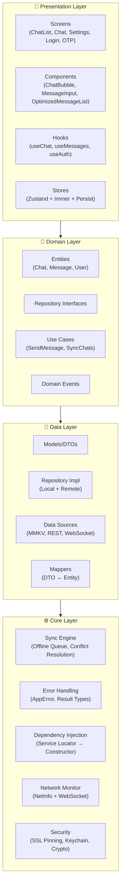

# ChatApp 2026 — Messaging Application

[](LICENSE)
[](https://www.typescriptlang.org/)
[](https://reactnative.dev/)
[](https://expo.dev/)
[](https://jestjs.io/)
[](coverage/lcov-report/index.html)

---

## 🎯 Overview

**ChatApp 2026** is a WhatsApp-style messaging application built on Clean Architecture with offline-first synchronization. This repository is an **active work in progress**: core layers (domain, data, stores, security transport) are implemented and tested, while several capabilities are stubs, wired to mocked backends, or not yet integrated into the running app. Every status claim below is tied to a command you can run — see [Verifying these claims](#-verifying-these-claims).

### ✨ Capability Status

Coverage figures come from `npx jest --coverage --silent` on the files listed in `jest.config.js` coverage collection.

| Capability               | Implementation                                         | Status                                                                                                       |
| ------------------------ | ------------------------------------------------------ | ------------------------------------------------------------------------------------------------------------ |
| **Real-time Chat**       | `ws` server + RN WebSocket client                      | Implemented; `useWebSocket.ts` untested (0%)                                                                 |
| **Offline-First Sync**   | Zustand stores + MMKV persist                          | Store-level complete; `useWebSocket.ts` integration untested                                                 |
| **Voice Messages**       | `VoiceRecorder` / `VoiceMessagePlayer`                 | Partially implemented — `expo-av` not installed; stub methods note this                                      |
| **Read Receipts**        | `ReadReceiptsManager` + WebSocket                      | Implemented, tested (75% statements)                                                                         |
| **Typing Indicators**    | `TypingIndicatorsManager` + debounced send             | Implemented, tested; `TypingIndicator.tsx` component deleted (dead code)                                     |
| **Media Handling**       | `MediaUploader` + FlashList                            | Uploader implemented; FlashList wired in `OptimizedMessageList`                                              |
| **Cross-Platform**       | iOS, Android, Web (Expo 54)                            | Web export verified; native builds not verified                                                              |
| **Security**             | SSL pinning (native-only), Keychain, encrypted storage | Implemented; keychain (57%) / secureStorage (60%) covered                                                    |
| **Internationalization** | i18next 26 + react-i18next 17, `client/src/i18n`       | Implemented: `en` + `ar` bundles, device-language detection, provider in `App.tsx`. Used by `ChatListScreen` |
| **Accessibility**        | Labels                                                 | Guidelines documented; no automated a11y verification                                                        |

---

## 🏗️ Architecture at a Glance



### Layer Responsibilities

| Layer            | Responsibility                                      | Key Technologies                                            |
| ---------------- | --------------------------------------------------- | ----------------------------------------------------------- |
| **Presentation** | UI, Navigation, State Management, User Interactions | React Native, React Navigation v7, Zustand v5, Reanimated 4 |
| **Domain**       | Business Rules, Entities, Use Cases, Validation     | Pure TypeScript, Date-fns                                   |
| **Data**         | API Clients, Local Storage, WebSocket, Data Mapping | TanStack Query v5, MMKV                                     |
| **Core**         | Sync Engine, Security, DI, Network Monitoring       | Custom Implementations                                      |

---

## 🛠️ Technology Stack

### Client (React Native + Expo)

```json
{
  "framework": "React Native 0.81.5 + Expo 54",
  "language": "TypeScript 5.9 (strict mode)",
  "state": "Zustand 5 + TanStack Query 5 + MMKV",
  "navigation": "React Navigation 7 (Native Stack + Bottom Tabs)",
  "ui": "React Native FlashList (@shopify/flash-list 2.0.2) + Reanimated 4 + Gesture Handler 2",
  "forms": "React Hook Form NOT installed — no RHF usage in client/src",
  "i18n": "i18next 26 + react-i18next 17 — en + ar bundles in client/src/i18n",
  "security": "react-native-keychain 10 + react-native-ssl-pinning (native builds only) + MMKV encrypted storage",
  "monitoring": "@sentry/react-native 7 + react-native-device-info 15",
  "testing": "Jest 29 + jest-expo + React Native Testing Library (no Detox, no E2E runner)"
}
```

Packages listed are those that appear in `package.json`.
`react-hook-form`, `expo-av`, `expo-secure-store`, `fastify`, `helmet`,
`argon2`, `redis`, `pg` and `detox` are **not** installed.

### Server (Node.js)

```json
{
  "runtime": "Node.js 20+ with TypeScript",
  "framework": "Express 5 (no Fastify)",
  "realtime": "WebSocket (ws 8) — single process, no Redis Pub/Sub",
  "database": "In-memory (MemStorage in server/storage.ts) — PostgreSQL planned",
  "auth": "JWT HS256 only (jsonwebtoken) — no refresh tokens, no Argon2/bcrypt",
  "security": "Hand-written CORS middleware + express-rate-limit on the OTP route + Zod validation (no Helmet)",
  "storage_note": "Drizzle schema exists in shared/schema.ts but is not wired to the server"
}
```

The server refuses to start without `JWT_SECRET` (`server/config.ts` throws).
All data is lost on restart.

### Quality & Reliability

| Tool               | Purpose                  | Configuration                                                               |
| ------------------ | ------------------------ | --------------------------------------------------------------------------- |
| **ESLint 9**       | Code quality             | `eslint.config.mjs` + `eslint-plugin-react-native` — 22 warnings (0 errors) |
| **Prettier 3**     | Code formatting          | `.prettierrc` + `plugin:prettier/recommended`                               |
| **TypeScript 5.9** | Static analysis          | `strict: true`, `noEmit: true`, `bundler` module resolution                 |
| **Jest 29**        | Unit/Integration testing | `jest-expo` preset; thresholds set to 85% but **not met**                   |
| **Husky 8**        | Git hooks                | `pre-commit` + `commit-msg` validation                                      |
| **GitHub Actions** | CI/CD                    | Multi-stage pipeline with quality gates                                     |

---

## 📂 Project Structure

```
messaging-application/            # single npm package (no workspaces)
├── client/                       # Expo app — sources live in client/src
│   ├── src/
│   │   ├── presentation/         # UI Layer
│   │   │   ├── screens/          # Route-level components
│   │   │   ├── components/       # Reusable UI components
│   │   │   ├── hooks/            # Presentation hooks
│   │   │   ├── stores/           # Zustand stores (chat, message, auth, sync, ui)
│   │   │   └── navigation/       # Navigation configuration
│   │   ├── domain/               # Business Logic Layer
│   │   │   ├── entities/         # Core entities (Chat, Message, User)
│   │   │   ├── repositories/     # Repository interfaces
│   │   │   ├── usecases/         # Application use cases
│   │   │   ├── services/         # Domain services (sorting, validation)
│   │   │   └── events/           # Domain events
│   │   ├── data/                 # Data Access Layer
│   │   │   ├── repositories/     # Repository implementations
│   │   │   ├── datasources/      # API, WebSocket, Local storage
│   │   │   ├── mappers/          # DTO ↔ Entity transformations
│   │   │   └── models/           # API response models
│   │   ├── core/                 # Cross-cutting Concerns
│   │   │   ├── sync/ errors/ di/ networking/ logger/
│   │   │   ├── media/ readReceipts/ typingIndicators/
│   │   ├── i18n/                 # i18next bootstrap, rtl.ts, dateHelper.ts, locales/
│   │   ├── security/             # Flat modules: keychain.ts, secureStorage.ts,
│   │   │                         # sslPinningConfig.ts, biometricAuth.ts,
│   │   │                         # deviceSecurity.ts, secureTransport.ts
│   │   ├── shared/               # Shared types, constants, utils, validation
│   │   ├── theme/                # colors.ts + tokens.ts
│   │   ├── lib/                  # query-client.ts, secureStorageAdapter.ts, storage/
│   │   ├── stores/               # featureFlagsStore.ts
│   │   ├── services/websocket/   # WebSocketClient, ChatService, MessageHandler
│   │   └── test-utils/           # Test helpers & mocks
│   └── assets/                   # Static assets (icons, images, fonts)
├── server/                       # Node.js backend (flat, no src/)
│   ├── index.ts routes.ts storage.ts websocket.ts config.ts init.sql
│   └── templates/landing-page.html
├── shared/                       # Cross-platform types — single file schema.ts
├── docs/                         # ACCESSIBILITY, API, SYNC_ENGINE_ARCHITECTURE, ADR/
├── scripts/                      # validate-env.js, check-console-logs.js, build.js, ...
├── .github/workflows/            # CI/CD pipelines
├── .husky/                       # Git hooks
├── docker-compose.yml nginx.conf # Local development stack + reverse proxy
├── app.json                      # Expo configuration (at repo root, not client/)
├── ARCHITECTURE.md CONTRIBUTING.md DEPLOYMENT.md ROADMAP.md SECURITY.md
├── tsconfig.json tsconfig.app.json tsconfig.test.json
├── eslint.config.mjs .prettierrc jest.config.js jest.setup.js babel.config.js
├── netlify.toml                  # Web deployment config
├── package.json
└── README.md
```

`ARCHITECTURE.md`, `DEPLOYMENT.md`, `ROADMAP.md` and `SECURITY.md` live at the
repository root, not under `docs/`.

---

## 🚀 Quick Start

### Prerequisites

| Tool               | Version          | Install Command                            |
| ------------------ | ---------------- | ------------------------------------------ |
| **Node.js**        | ≥ 18 (`engines`) | `nvm install 18` / `volta install node@18` |
| **npm**            | ≥ 9.8.0          | Included with Node.js                      |
| **Expo CLI**       | Latest           | `npm install -g expo-cli`                  |
| **Git**            | Latest           | `git-scm.com`                              |
| **Watchman**       | ≥ 2023.01.02     | `brew install watchman` (macOS)            |
| **Android Studio** | Latest           | For Android development                    |
| **Xcode 15+**      | Latest           | For iOS development (macOS only)           |

### Installation

```bash
# 1. Clone the repository
git clone https://github.com/your-org/chatapp.git
cd messaging-application

# 2. Install dependencies (single package, not a workspace monorepo)
npm install

# 3. Set up environment variables
cp .env.example .env
# Edit .env with your configuration — EXPO_PUBLIC_DOMAIN is REQUIRED
# (client/src/lib/query-client.ts throws if it is missing)

# 4. Start development servers
npm run dev              # Starts Expo client (metro bundler)
npm run server:dev       # Starts the backend (separate terminal)
```

This project uses Expo's managed workflow, so there is no `client/ios`
directory and no `pod install` step. Run `npx expo prebuild` only if you
deliberately switch to a bare workflow.

### Platform-Specific Commands

```bash
# Development
npm run android          # Build & run on Android emulator/device
npm run ios              # Build & run on iOS simulator/device
npm run web              # Launch Expo web build

# Code Quality
npm run lint             # ESLint checks
npm run lint:fix         # Auto-fix ESLint issues
npm run format           # Prettier format
npm run format:check     # Verify formatting
npm run type-check       # TypeScript strict type checking
npm run validate         # Run all quality checks (lint + type-check + format)

# Testing
npm test                 # Run unit & integration tests
npm run test:watch       # Watch mode for development
npm run test:coverage    # Run tests with coverage report
npm run test:performance # Run performance benchmarks

# Building
npm run build:web        # Build for web (output: dist/)
npm run bundle:analyze   # Analyze bundle size

# Security
npm run security:check   # Security audit + validation
npm run audit:deps       # npm audit (high severity)
npm run audit:deps:fix   # Attempt auto-fix
```

---

## 🌍 Environment Configuration

Create a `.env` file in the project root. The table lists **only** the
variables that are read by code, verified with
`grep -rhoE "process\.env\.EXPO_PUBLIC_[A-Z_]+" client/src scripts shared | sort -u`.

| Variable                        | Required      | Read by                             | Notes                                                                                                                                                        |
| ------------------------------- | ------------- | ----------------------------------- | ------------------------------------------------------------------------------------------------------------------------------------------------------------ |
| `EXPO_PUBLIC_DOMAIN`            | **Yes**       | `client/src/lib/query-client.ts:11` | Throws at import if unset. Also set by `scripts/build.js`                                                                                                    |
| `EXPO_PUBLIC_API_URL`           | Production    | `RemoteApiDataSource.ts:11`, CI     | Base REST URL (defaults to `https://api.chatapp.com`)                                                                                                        |
| `EXPO_PUBLIC_WS_URL`            | Production    | `WebSocketClient.ts:261`, CI        | WebSocket URL                                                                                                                                                |
| `EXPO_PUBLIC_SENTRY_DSN`        | Production    | Sentry init                         | `validate-env.js`                                                                                                                                            |
| `EXPO_PUBLIC_CERT_HASHES`       | Native builds | `sslPinningConfig.ts`               | Comma-separated `sha256/` + 44-char base64 SPKI pins. **Must be a real pin**; `validate-env.js` rejects empty or placeholder values. Web builds skip pinning |
| `EXPO_PUBLIC_BACKEND_DOMAIN`    | Production    | `sslPinningConfig.ts`               | Defaults to `api.chatapp.com`                                                                                                                                |
| `EXPO_PUBLIC_BACKEND_WS_DOMAIN` | Production    | `sslPinningConfig.ts`               | Defaults to `ws.chatapp.com`                                                                                                                                 |
| `EXPO_PUBLIC_USE_MOCK_AUTH`     | No            | `MockAuthDataSource`                | `true` enables frontend-only login with no backend                                                                                                           |
| `EXPO_PUBLIC_APP_NAME`          | No            | `sentry.ts:74`                      | Release naming                                                                                                                                               |
| `EXPO_PUBLIC_VERSION`           | No            | `sentry.ts:50,74`                   | Release naming                                                                                                                                               |
| `EXPO_PUBLIC_BUILD_NUMBER`      | No            | `sentry.ts:75`                      | Release naming                                                                                                                                               |
| `EXPO_PUBLIC_UPLOAD_URL`        | No            | `MediaUploader.ts:36`               | Defaults to `https://api.chatapp.com/upload`                                                                                                                 |

Server-side (never `EXPO_PUBLIC_`): `JWT_SECRET` (required — the server throws
without it), `JWT_REFRESH_SECRET`, `PORT`, `REPLIT_DEV_DOMAIN`, `REPLIT_DOMAINS`.

The following variables appear in older documentation but **are not read by any
code** and have no effect: `EXPO_PUBLIC_ENABLE_ANALYTICS`,
`EXPO_PUBLIC_ENABLE_VOICE_MESSAGES`, `EXPO_PUBLIC_ENABLE_REACTIONS`,
`EXPO_PUBLIC_ENABLE_ADVANCED_SEARCH`, `EXPO_PUBLIC_ENABLE_E2E_ENCRYPTION`,
`EXPO_PUBLIC_ENABLE_FEATURE_FLAGS`, `EXPO_PUBLIC_DEV_MODE`,
`EXPO_PUBLIC_MOCK_API_DELAY`. Feature flags are currently hardcoded in
`client/src/stores/featureFlagsStore.ts` (`DEFAULT_FEATURE_FLAGS`).

---

## 📜 Available Scripts

### Development

| Command              | Description                   |
| -------------------- | ----------------------------- |
| `npm run dev`        | Start Expo development server |
| `npm run server:dev` | Start WebSocket backend (tsx) |
| `npm run android`    | Build & run on Android        |
| `npm run ios`        | Build & run on iOS            |
| `npm run web`        | Launch Expo web build         |

### Code Quality

| Command                | Description                     |
| ---------------------- | ------------------------------- |
| `npm run lint`         | Run ESLint                      |
| `npm run lint:fix`     | Auto-fix ESLint issues          |
| `npm run format`       | Format with Prettier            |
| `npm run format:check` | Check formatting                |
| `npm run type-check`   | TypeScript strict type checking |
| `npm run validate`     | Run all quality checks          |

### Testing

| Command                    | Description            |
| -------------------------- | ---------------------- |
| `npm test`                 | Run all tests          |
| `npm run test:watch`       | Watch mode             |
| `npm run test:coverage`    | Coverage report        |
| `npm run test:performance` | Performance benchmarks |

### Build & Deploy

| Command                  | Description                     |
| ------------------------ | ------------------------------- |
| `npm run build:web`      | Build for web (output: `dist/`) |
| `npm run bundle:analyze` | Bundle size analysis            |
| `npm run preview:web`    | Preview production web build    |

### Maintenance

| Command                  | Description                        |
| ------------------------ | ---------------------------------- |
| `npm run clean`          | Clean build artifacts              |
| `npm run prepare`        | Install Husky git hooks            |
| `npm run security:check` | Full security audit                |
| `npm run check:console`  | Verify no console.log in prod code |

---

## 🛡️ Security Overview

The project implements **layered** security. What is actually enforced today:

| Layer                | Measures                                                                                                                                                                                                                   |
| -------------------- | -------------------------------------------------------------------------------------------------------------------------------------------------------------------------------------------------------------------------- |
| **Network**          | HTTPS/WSS enforced in code (`getSecureUrl`, `enforceSecureUrl`); certificate pinning on **native** builds only; HSTS + CSP + `X-Frame-Options` come from `nginx.conf`, **not** from the Node app (Helmet is not installed) |
| **Authentication**   | JWT HS256 issued by the server; Keychain for credentials; biometric auth available                                                                                                                                         |
| **Data Protection**  | MMKV encrypted persistence, Keychain, SecureStore wrapper — E2E encryption **not implemented**                                                                                                                             |
| **Input Validation** | Zod schemas on server payloads; `validate-env.js` on build env vars                                                                                                                                                        |
| **Device Security**  | Jailbreak/root detection (`deviceSecurity.ts`)                                                                                                                                                                             |
| **Monitoring**       | Sentry error tracking                                                                                                                                                                                                      |
| **CI/CD**            | `npm audit`, Trivy scan, `check:console`, `validate:env`                                                                                                                                                                   |

Known gaps: `keychain.ts` (57%) and `secureStorage.ts` (60%) are the least-tested
security modules, and the server has no security-header middleware of its own.

See [SECURITY.md](SECURITY.md) for detailed security architecture and vulnerability management.

---

## ♿ Accessibility

Accessibility guidelines and a manual testing checklist are
documented in [docs/ACCESSIBILITY.md](docs/ACCESSIBILITY.md). Automated
contrast, screen-reader, and keyboard-navigation checks are **not** run in CI,
so WCAG conformance has not been independently verified.

---

## 📚 Documentation

| Document                                                             | Description                                         |
| -------------------------------------------------------------------- | --------------------------------------------------- |
| [ARCHITECTURE.md](ARCHITECTURE.md)                                   | System architecture, patterns, and design decisions |
| [CONTRIBUTING.md](CONTRIBUTING.md)                                   | Development workflow, coding standards, PR process  |
| [DEPLOYMENT.md](DEPLOYMENT.md)                                       | Production deployment guide for all platforms       |
| [ROADMAP.md](ROADMAP.md)                                             | Strategic roadmap with milestones                   |
| [SECURITY.md](SECURITY.md)                                           | Security architecture, vulnerability management     |
| [docs/SYNC_ENGINE_ARCHITECTURE.md](docs/SYNC_ENGINE_ARCHITECTURE.md) | Offline-first sync engine deep dive                 |
| [docs/ACCESSIBILITY.md](docs/ACCESSIBILITY.md)                       | Accessibility implementation & testing              |
| [docs/API.md](docs/API.md)                                           | REST & WebSocket API reference                      |
| [docs/ADR/](docs/ADR/)                                               | Architecture Decision Records                       |

---

## 🤝 Contributing

We welcome contributions! Please review our [Contributing Guide](CONTRIBUTING.md) before submitting PRs.

### Quick Contribution Checklist

1. **Fork** the repository
2. **Create a feature branch: `git checkout -b feature/your-feature`**
3. **Follow [Conventional Commits](https://www.conventionalcommits.org/)**
4. **Write tests for new functionality (≥90% coverage for new code)**
5. **Run `npm run validate` — all checks must pass**
6. **Update documentation if needed**
7. **Submit a Pull Request with clear description**

### Code Style Requirements

- TypeScript **strict mode** — no `any`, explicit return types for public APIs
- **Prettier** formatting — run `npm run format` before committing
- **ESLint zero errors** — run `npm run lint` (22 pre-existing warnings documented)
- **Accessibility** — follow [docs/ACCESSIBILITY.md](docs/ACCESSIBILITY.md)
- **Tests** — unit tests for logic, component tests for UI
- **Do not document unimplemented behaviour as complete.** If a capability is a
  stub, say so in the README status table.

---

## 📈 Success Metrics

Measured on this machine at commit-time. Reproduce with the commands in
[Verifying these claims](#-verifying-these-claims).

| Metric                         | Target      | Actual                                                                                                                                                                       |
| ------------------------------ | ----------- | ---------------------------------------------------------------------------------------------------------------------------------------------------------------------------- |
| **Test Coverage (statements)** | 85%         | **61.2%** — below target                                                                                                                                                     |
| **Test Coverage (branches)**   | 85%         | **57.1%** — below target                                                                                                                                                     |
| **Test Coverage (functions)**  | 85%         | **60.5%** — below target                                                                                                                                                     |
| **Test Coverage (lines)**      | 85%         | **61.5%** — below target                                                                                                                                                     |
| **Tests passing**              | all green   | 1610 / 1610 across 63 suites                                                                                                                                                 |
| **TypeScript errors**          | 0           | 0 (`tsconfig.json`, `tsconfig.app.json`, `tsconfig.test.json`)                                                                                                               |
| **ESLint**                     | 0 errors    | 0 errors, **22 warnings** (pre-existing)                                                                                                                                     |
| **Web bundle size**            | < 2 MB      | **~10 MB** single JS file (`dist/`) — above target                                                                                                                           |
| **Mobile bundle size**         | < 2 MB      | **Not measured** in this environment                                                                                                                                         |
| **`npm audit` high/critical**  | 0           | **54 high**, 20 moderate — all in the build/test toolchain except `@sentry/react-native` (a runtime dependency). Every suggested fix is a semver-major bump and needs review |
| **Accessibility conformance**  | WCAG 2.1 AA | **Not verified** — no automated checks                                                                                                                                       |
| **WebSocket latency**          | < 100ms     | **Not measured**                                                                                                                                                             |

`jest.config.js` sets an 85% global coverage threshold, so
`npm run test:coverage` currently exits non-zero. That is a real, visible gap,
not a config problem.

---

## 🔍 Verifying these claims

Every status claim above can be checked:

```powershell
# Coverage numbers, file list, and the threshold failure
npx jest --coverage --silent

# Dependency claims (installed vs. not installed)
Select-String -Path package.json -Pattern '"fastify"|"helmet"|"argon2"|"redis"|"pg"|"react-hook-form"|"expo-av"|"expo-secure-store"|"detox"'

# FlashList is wired in OptimizedMessageList
Select-String -Path client/src -Pattern "@shopify/flash-list"

# OptimizedMessageList is imported by ChatScreen
Select-String -Path client/src -Pattern "OptimizedMessageList"

# Server uses in-memory storage, not Postgres/Drizzle
Select-String -Path server\storage.ts -Pattern "MemStorage"
Select-String -Path server\routes.ts,server\index.ts -Pattern "drizzle|pg|helmet|fastify"

# Security headers come from nginx, not the Node app
Select-String -Path nginx.conf -Pattern "Strict-Transport-Security"

# Bundled locales (en + ar); the orphaned core/i18n module was removed
Get-ChildItem -Recurse client\src\i18n\locales -Name
Select-String -Path client\src\App.tsx -Pattern "I18nextProvider|@/i18n"

# Version alignment
node -p "require('./package.json').version" ; Select-String -Path app.json -Pattern '"version"|"runtimeVersion"'

# Bundle size
npm run build:web ; (Get-ChildItem -Recurse -File dist -Filter *.js | Measure-Object Length -Sum).Sum

# Dependency vulnerabilities
npm audit --audit-level=high
```

---

## 🗺️ Roadmap

### Planned features

- RTL layout switching — `client/src/i18n/rtl.ts` ships `applyRTL`/`useRTL` but
  nothing calls them; selecting `ar` today renders Arabic text in an LTR layout
- A language switcher UI (the previous `LanguageSwitcher` component was removed
  as dead code, which leaves no way to change language at runtime)
- Translations beyond `en` and `ar`

> Internationalization itself is **not** planned work: i18next is initialised in
> `client/src/i18n/index.ts`, mounted in `App.tsx`, and used by `ChatListScreen`.

| Quarter     | Focus                | Key Deliverables                                    |
| ----------- | -------------------- | --------------------------------------------------- |
| **Q3 2026** | Production Hardening | 95% test coverage, E2E tests, performance dashboard |
| **Q4 2026** | Scale & Security     | E2E encryption, bundle <1MB, multi-device sync      |
| **Q1 2027** | Enterprise Features  | Advanced moderation, analytics, integrations        |

See [ROADMAP.md](ROADMAP.md) for detailed milestones and technical debt tracking.

---

## 📞 Support & Community

- **Issues**: [GitHub Issues](https://github.com/your-org/chatapp/issues) — Bug reports & feature requests
- **Discussions**: [GitHub Discussions](https://github.com/your-org/chatapp/discussions) — Technical Q&A
- **Security**: `security@chatapp.com` — Responsible disclosure (PGP key available)
- **Documentation**: [Wiki](https://github.com/your-org/chatapp/wiki) — Extended guides

---

## 📄 License

**MIT License** — Copyright © 2026 ChatApp Contributors

```
Permission is hereby granted, free of charge, to any person obtaining a copy
of this software and associated documentation files (the "Software"), to deal
in the Software without restriction, including without limitation the rights
to use, copy, modify, merge, publish, distribute, sublicense, and/or sell
copies of the Software...
```

See [LICENSE](LICENSE) for full text.

---

<div align="center">

**Built with ❤️ for modern mobile development**
**Powered by Clean Architecture · TypeScript · React Native · Expo**

[🔝 Back to Top](#chatapp-2026--messaging-application)

</div>
