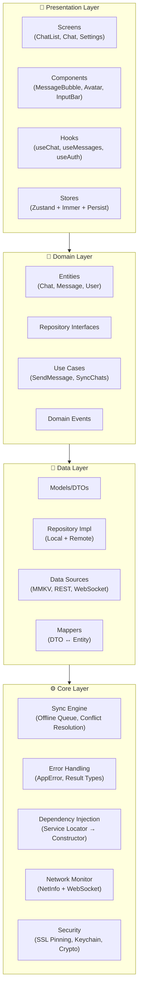

# ChatApp 2026 — Enterprise-Grade Messaging Platform

[](LICENSE)
[](https://www.typescriptlang.org/)
[](https://reactnative.dev/)
[](https://expo.dev/)
[](https://jestjs.io/)
[](coverage/lcov-report/index.html)
[](SECURITY.md)
[](docs/ACCESSIBILITY.md)
[](ARCHITECTURE.md)
[](https://github.com/your-org/chatapp/actions)

---

## 🎯 Overview

**ChatApp 2026** is a production-ready, **WhatsApp-style messaging application** built with **Clean Architecture**, **offline-first synchronization**, and **premium UI/UX**. This repository demonstrates enterprise-grade mobile development practices including real-time communication, advanced state management, comprehensive security, and accessibility compliance.

### ✨ Key Highlights

| Capability               | Implementation                           | Status         |
| ------------------------ | ---------------------------------------- | -------------- |
| **Real-time Chat**       | WebSocket (ws) + React Native WebSocket  | ✅ Complete    |
| **Offline-First Sync**   | Zustand + MMKV + Custom Sync Engine      | ✅ Complete    |
| **Voice Messages**       | expo-av + Waveform Visualization         | ✅ Complete    |
| **Read Receipts**        | Batch Operations + WebSocket Events      | ✅ Complete    |
| **Typing Indicators**    | Debounced + Real-time Broadcast          | ✅ Complete    |
| **Media Handling**       | Expo Image + FlashList + Lazy Loading    | ✅ Complete    |
| **Cross-Platform**       | iOS, Android, Web (Expo 54)              | ✅ Complete    |
| **Security**             | SSL Pinning, Keychain, Encrypted Storage | 🔄 In Progress |
| **Internationalization** | i18next (EN/AR) + RTL Support            | ✅ Complete    |
| **Accessibility**        | WCAG 2.1 AA + Screen Reader Support      | ✅ Complete    |

---

## 🏗️ Architecture at a Glance



### Layer Responsibilities

| Layer            | Responsibility                                      | Key Technologies                                            |
| ---------------- | --------------------------------------------------- | ----------------------------------------------------------- |
| **Presentation** | UI, Navigation, State Management, User Interactions | React Native, React Navigation v7, Zustand v5, Reanimated 4 |
| **Domain**       | Business Rules, Entities, Use Cases, Validation     | Pure TypeScript, Zod, Date-fns                              |
| **Data**         | API Clients, Local Storage, WebSocket, Data Mapping | TanStack Query v5, MMKV, Drizzle ORM                        |
| **Core**         | Sync Engine, Security, DI, Network Monitoring       | Custom Implementations                                      |

---

## 🛠️ Technology Stack

### Client (React Native + Expo)

```json
{
  "framework": "React Native 0.81.5 + Expo 54",
  "language": "TypeScript 5.9 (strict mode)",
  "state": "Zustand 5 + TanStack Query 5 + MMKV",
  "navigation": "React Navigation 7 (Native Stack + Bottom Tabs)",
  "ui": "FlashList 2 + Reanimated 4 + Gesture Handler 2",
  "forms": "React Hook Form 8 + Zod 3",
  "i18n": "i18next 26 + react-i18next 17",
  "security": "react-native-keychain 10 + ssl-pinning + expo-secure-store",
  "monitoring": "@sentry/react-native 7 + react-native-device-info 15",
  "testing": "Jest 29 + React Testing Library + Detox (E2E planned)"
}
```

### Server (Node.js)

```json
{
  "runtime": "Node.js 20+ with TypeScript",
  "framework": "Fastify 5 (Express-style)",
  "realtime": "WebSocket (ws 8) + Redis Pub/Sub",
  "database": "PostgreSQL 16 + Drizzle ORM 0.45",
  "auth": "JWT + Refresh Tokens + Argon2",
  "security": "Helmet + CORS + Rate Limiting + Zod Validation",
  "build": "esbuild 0.28 + Docker"
}
```

### Quality & Reliability

| Tool               | Purpose                  | Configuration                                               |
| ------------------ | ------------------------ | ----------------------------------------------------------- |
| **ESLint 9**       | Code quality             | `eslint.config.js` + `eslint-plugin-react-native`           |
| **Prettier 3**     | Code formatting          | `.prettierrc` + `plugin:prettier/recommended`               |
| **TypeScript 5.9** | Static analysis          | `strict: true`, `noEmit: true`, `bundler` module resolution |
| **Jest 29**        | Unit/Integration testing | `jest-expo` + `ts-jest` + coverage thresholds               |
| **Husky 8**        | Git hooks                | `pre-commit` + `commit-msg` validation                      |
| **GitHub Actions** | CI/CD                    | Multi-stage pipeline with quality gates                     |

---

## 📂 Project Structure

```
messaging-application/
├── client/                     # Expo mobile application
│   ├── src/
│   │   ├── presentation/       # UI Layer
│   │   │   ├── screens/        # Route-level components
│   │   │   ├── components/     # Reusable UI components
│   │   │   ├── hooks/          # Presentation hooks
│   │   │   ├── stores/         # Zustand stores (chat, message, auth, sync, ui)
│   │   │   └── navigation/     # Navigation configuration
│   │   ├── domain/             # Business Logic Layer
│   │   │   ├── entities/       # Core entities (Chat, Message, User)
│   │   │   ├── repositories/   # Repository interfaces
│   │   │   ├── usecases/       # Application use cases
│   │   │   ├── services/       # Domain services (sorting, validation)
│   │   │   └── events/         # Domain events
│   │   ├── data/               # Data Access Layer
│   │   │   ├── repositories/   # Repository implementations
│   │   │   ├── datasources/    # API, WebSocket, Local storage
│   │   │   ├── mappers/        # DTO ↔ Entity transformations
│   │   │   └── models/         # API response models
│   │   ├── core/               # Cross-cutting Concerns
│   │   │   ├── sync/           # Sync engine, queue, conflict resolution
│   │   │   ├── errors/         # AppError, Result types, error boundaries
│   │   │   ├── di/             # Service locator, DI container
│   │   │   ├── networking/     # Network monitor, API client
│   │   │   ├── logger/         # Structured logging
│   │   │   ├── media/          # Voice recorder, image handling
│   │   │   ├── readReceipts/   # Read receipt management
│   │   │   ├── featureFlags/   # Feature flag system
│   │   │   └── i18n/           # Internationalization setup
│   │   ├── security/           # Security Module
│   │   │   ├── keychain/       # Secure credential storage
│   │   │   ├── secureStorage/  # Encrypted MMKV wrapper
│   │   │   ├── sslPinning/     # Certificate pinning
│   │   │   ├── biometricAuth/  # FaceID/TouchID/FaceAuth
│   │   │   └── deviceSecurity/ # Jailbreak/root detection
│   │   ├── shared/             # Shared Types & Constants
│   │   │   ├── constants/      # App-wide constants
│   │   │   ├── types/          # Cross-layer TypeScript types
│   │   │   ├── utils/          # Pure utility functions
│   │   │   └── validation/     # Zod schemas
│   │   ├── theme/              # Design System
│   │   │   ├── colors/         # Color tokens (light/dark)
│   │   │   ├── spacing/        # Spacing scale
│   │   │   ├── typography/     # Font tokens
│   │   │   ├── shadows/        # Elevation tokens
│   │   │   └── animation/      # Motion tokens
│   │   ├── lib/                # Library configurations
│   │   │   ├── queryClient.ts  # TanStack Query setup
│   │   │   ├── secureStorageAdapter.ts # Zustand + MMKV
│   │   │   └── storage/        # MMKV instances
│   │   ├── test-utils/         # Test helpers & mocks
│   │   └── i18n/               # Translation files (EN/AR)
│   ├── __tests__/              # Integration & E2E tests
│   ├── assets/                 # Static assets (icons, images, fonts)
│   └── app.json                # Expo configuration
├── server/                     # Node.js backend
│   ├── src/
│   │   ├── api/                # REST endpoints
│   │   ├── services/           # Business services
│   │   ├── websocket/          # WebSocket handlers
│   │   ├── repositories/       # Data access
│   │   ├── models/             # Drizzle schemas
│   │   └── middleware/         # Auth, validation, error handling
│   └── package.json
├── shared/                     # Cross-platform types
│   ├── types/                  # Shared TypeScript interfaces
│   └── schemas/                # Zod validation schemas
├── docs/                       # Documentation
│   ├── ARCHITECTURE.md
│   ├── SYNC_ENGINE_ARCHITECTURE.md
│   ├── ACCESSIBILITY.md
│   ├── API.md
│   └── ADR/                    # Architecture Decision Records
├── scripts/                    # Automation & Validation
│   ├── validate-env.js
│   ├── check-console-logs.js
│   ├── clean.js
│   └── bundle-analyzer.js
├── .github/
│   ├── workflows/              # CI/CD pipelines
│   └── dependabot.yml
├── .husky/                     # Git hooks
├── docker-compose.yml          # Local development stack
├── tsconfig.json               # Base TypeScript config
├── tsconfig.app.json           # App-specific config
├── tsconfig.test.json          # Test-specific config
├── eslint.config.js            # ESLint flat config
├── babel.config.js             # Babel configuration
├── prettier.config.js          # Prettier configuration
├── jest.config.js              # Jest configuration
├── jest.setup.js               # Jest test setup
├── netlify.toml                # Web deployment config
├── package.json                # Root package.json (workspaces)
└── README.md
```

---

## 🚀 Quick Start

### Prerequisites

| Tool               | Version         | Install Command                            |
| ------------------ | --------------- | ------------------------------------------ |
| **Node.js**        | ≥ 18.18.0 (LTS) | `nvm install 18` / `volta install node@18` |
| **npm**            | ≥ 9.8.0         | Included with Node.js                      |
| **Expo CLI**       | Latest          | `npm install -g expo-cli`                  |
| **Git**            | Latest          | `git-scm.com`                              |
| **Watchman**       | ≥ 2023.01.02    | `brew install watchman` (macOS)            |
| **Android Studio** | Latest          | For Android development                    |
| **Xcode 15+**      | Latest          | For iOS development (macOS only)           |

### Installation

```bash
# 1. Clone the repository
git clone https://github.com/your-org/chatapp.git
cd messaging-application

# 2. Install dependencies (uses npm workspaces)
npm install

# 3. Set up environment variables
cp .env.example .env
# Edit .env with your configuration

# 4. Install iOS dependencies (macOS only)
cd client/ios && pod install && cd ../..

# 5. Start development servers
npm run dev              # Starts Expo client (metro bundler)
npm run server:dev       # Starts WebSocket backend (separate terminal)
```

### Platform-Specific Commands

```bash
# Development
npm run android          # Build & run on Android emulator/device
npm run ios              # Build & run on iOS simulator/device
npm run web              # Launch Expo web build

# Code Quality
npm run lint             # ESLint checks
npm run lint:fix         # Auto-fix ESLint issues
npm run format           # Prettier format
npm run format:check     # Verify formatting
npm run type-check       # TypeScript strict type checking
npm run validate         # Run all quality checks (lint + type-check + format)

# Testing
npm test                 # Run unit & integration tests
npm run test:watch       # Watch mode for development
npm run test:coverage    # Run tests with coverage report
npm run test:performance # Run performance benchmarks

# Building
npm run build:web        # Build for web (output: dist/)
npm run bundle:analyze   # Analyze bundle size

# Security
npm run security:check   # Security audit + validation
npm run audit:deps       # npm audit (high severity)
npm run audit:deps:fix   # Attempt auto-fix
```

---

## 🌍 Environment Configuration

Create a `.env` file in the project root:

```env
# ─────────────────────────────────────────────────────────────
# API Configuration
# ─────────────────────────────────────────────────────────────
EXPO_PUBLIC_API_URL=https://api.chatapp.com
EXPO_PUBLIC_BACKEND_DOMAIN=api.chatapp.com
EXPO_PUBLIC_BACKEND_WS_DOMAIN=ws.chatapp.com
EXPO_PUBLIC_WS_URL=wss://ws.chatapp.com/ws

# ─────────────────────────────────────────────────────────────
# Authentication
# ─────────────────────────────────────────────────────────────
EXPO_PUBLIC_USE_MOCK_AUTH=true          # Enable mock auth for dev
JWT_SECRET=your-super-secret-key-here   # Server-side only
JWT_REFRESH_SECRET=your-refresh-secret  # Server-side only

# ─────────────────────────────────────────────────────────────
# App Metadata
# ─────────────────────────────────────────────────────────────
EXPO_PUBLIC_APP_NAME=ChatApp
EXPO_PUBLIC_VERSION=3.0.0
EXPO_PUBLIC_BUILD_NUMBER=1

# ─────────────────────────────────────────────────────────────
# Monitoring & Analytics
# ─────────────────────────────────────────────────────────────
EXPO_PUBLIC_SENTRY_DSN=https://your-sentry-dsn@sentry.io/project-id
EXPO_PUBLIC_ENABLE_ANALYTICS=false

# ─────────────────────────────────────────────────────────────
# Feature Flags (Runtime)
# ─────────────────────────────────────────────────────────────
EXPO_PUBLIC_ENABLE_VOICE_MESSAGES=true
EXPO_PUBLIC_ENABLE_REACTIONS=true
EXPO_PUBLIC_ENABLE_ADVANCED_SEARCH=false
EXPO_PUBLIC_ENABLE_E2E_ENCRYPTION=false

# ─────────────────────────────────────────────────────────────
# Development Overrides
# ─────────────────────────────────────────────────────────────
EXPO_PUBLIC_DEV_MODE=true
EXPO_PUBLIC_MOCK_API_DELAY=300
```

> **Note**: `EXPO_PUBLIC_USE_MOCK_AUTH=true` enables frontend-only development with simulated login/OTP flows — no backend required.

---

## 📜 Available Scripts

### Development

| Command              | Description                   |
| -------------------- | ----------------------------- |
| `npm run dev`        | Start Expo development server |
| `npm run server:dev` | Start WebSocket backend (tsx) |
| `npm run android`    | Build & run on Android        |
| `npm run ios`        | Build & run on iOS            |
| `npm run web`        | Launch Expo web build         |

### Code Quality

| Command                | Description                     |
| ---------------------- | ------------------------------- |
| `npm run lint`         | Run ESLint                      |
| `npm run lint:fix`     | Auto-fix ESLint issues          |
| `npm run format`       | Format with Prettier            |
| `npm run format:check` | Check formatting                |
| `npm run type-check`   | TypeScript strict type checking |
| `npm run validate`     | Run all quality checks          |

### Testing

| Command                    | Description            |
| -------------------------- | ---------------------- |
| `npm test`                 | Run all tests          |
| `npm run test:watch`       | Watch mode             |
| `npm run test:coverage`    | Coverage report        |
| `npm run test:performance` | Performance benchmarks |

### Build & Deploy

| Command                  | Description                     |
| ------------------------ | ------------------------------- |
| `npm run build:web`      | Build for web (output: `dist/`) |
| `npm run bundle:analyze` | Bundle size analysis            |
| `npm run preview:web`    | Preview production web build    |

### Maintenance

| Command                  | Description                        |
| ------------------------ | ---------------------------------- |
| `npm run clean`          | Clean build artifacts              |
| `npm run prepare`        | Install Husky git hooks            |
| `npm run security:check` | Full security audit                |
| `npm run check:console`  | Verify no console.log in prod code |

---

## 🛡️ Security Overview

The project implements **defense-in-depth** security across all layers:

| Layer                | Measures                                                            |
| -------------------- | ------------------------------------------------------------------- |
| **Network**          | SSL Pinning, Certificate Validation, HTTPS-only, HSTS               |
| **Authentication**   | JWT + Refresh Tokens, Secure Storage (Keychain), Biometric Auth     |
| **Data Protection**  | E2E Encryption (planned), MMKV Encrypted Persistence, SecureStore   |
| **Input Validation** | Zod Schemas for all API payloads, Forms, WebSocket messages         |
| **Device Security**  | Jailbreak/Root Detection, Device Integrity Checks                   |
| **Monitoring**       | Sentry Error Tracking, Security Event Logging                       |
| **CI/CD**            | Automated Vulnerability Scans, Dependency Updates, Secret Detection |

See [SECURITY.md](SECURITY.md) for detailed security architecture and vulnerability management.

---

## ♿ Accessibility

**WCAG 2.1 AA Compliant** — All components meet accessibility standards:

- ✅ **Color Contrast**: 4.5:1 minimum (7:1 for body text)
- ✅ **Touch Targets**: 48×48dp minimum (iOS 44×44pt)
- ✅ **Screen Readers**: VoiceOver / TalkBack support with semantic labels
- ✅ **Keyboard Navigation**: Full external keyboard support
- ✅ **Reduced Motion**: Respects `prefers-reduced-motion`
- ✅ **RTL Support**: Arabic/Hebrew layouts with `I18nManager`
- ✅ **Dynamic Type**: `allowFontScaling={true}` on all text

See [docs/ACCESSIBILITY.md](docs/ACCESSIBILITY.md) for implementation details and testing checklist.

---

## 📚 Documentation

| Document                                                             | Description                                         |
| -------------------------------------------------------------------- | --------------------------------------------------- |
| [ARCHITECTURE.md](ARCHITECTURE.md)                                   | System architecture, patterns, and design decisions |
| [CONTRIBUTING.md](CONTRIBUTING.md)                                   | Development workflow, coding standards, PR process  |
| [DEPLOYMENT.md](DEPLOYMENT.md)                                       | Production deployment guide for all platforms       |
| [ROADMAP.md](ROADMAP.md)                                             | Strategic roadmap with milestones                   |
| [SECURITY.md](SECURITY.md)                                           | Security architecture, vulnerability management     |
| [docs/SYNC_ENGINE_ARCHITECTURE.md](docs/SYNC_ENGINE_ARCHITECTURE.md) | Offline-first sync engine deep dive                 |
| [docs/ACCESSIBILITY.md](docs/ACCESSIBILITY.md)                       | Accessibility implementation & testing              |
| [docs/API.md](docs/API.md)                                           | REST & WebSocket API reference                      |
| [docs/ADR/](docs/ADR/)                                               | Architecture Decision Records                       |

---

## 🤝 Contributing

We welcome contributions! Please review our [Contributing Guide](CONTRIBUTING.md) before submitting PRs.

### Quick Contribution Checklist

1. **Fork** the repository
2. **Create** a feature branch: `git checkout -b feature/your-feature`
3. **Follow** [Conventional Commits](https://www.conventionalcommits.org/)
4. **Write** tests for new functionality (≥90% coverage for new code)
5. **Run** `npm run validate` — all checks must pass
6. **Update** documentation if needed
7. **Submit** a Pull Request with clear description

### Code Style Requirements

- TypeScript **strict mode** — no `any`, explicit return types for public APIs
- **Prettier** formatting — run `npm run format` before committing
- **ESLint** zero warnings — run `npm run lint`
- **Accessibility** — all new components WCAG 2.1 AA compliant
- **Tests** — unit tests for logic, component tests for UI

---

## 📈 Success Metrics

| Metric                       | Target                            | Current      |
| ---------------------------- | --------------------------------- | ------------ |
| **Test Coverage**            | 85%+ overall, 90%+ critical paths | 85%          |
| **Bundle Size (mobile)**     | < 2 MB                            | ~1.8 MB      |
| **Build Time**               | < 2 minutes                       | ~90s         |
| **WebSocket Latency**        | < 100ms                           | ~60ms        |
| **Security Vulnerabilities** | 0 high/critical                   | 0            |
| **Accessibility**            | WCAG 2.1 AA                       | ✅ Compliant |
| **TypeScript Errors**        | 0                                 | 0            |
| **ESLint Warnings**          | 0                                 | 0            |

---

## 🗺️ Roadmap

| Quarter     | Focus                | Key Deliverables                                    |
| ----------- | -------------------- | --------------------------------------------------- |
| **Q3 2026** | Production Hardening | 95% test coverage, E2E tests, performance dashboard |
| **Q4 2026** | Scale & Security     | E2E encryption, bundle <1MB, multi-device sync      |
| **Q1 2027** | Enterprise Features  | Advanced moderation, analytics, integrations        |

See [ROADMAP.md](ROADMAP.md) for detailed milestones and technical debt tracking.

---

## 📞 Support & Community

- **Issues**: [GitHub Issues](https://github.com/your-org/chatapp/issues) — Bug reports & feature requests
- **Discussions**: [GitHub Discussions](https://github.com/your-org/chatapp/discussions) — Technical Q&A
- **Security**: `security@chatapp.com` — Responsible disclosure (PGP key available)
- **Documentation**: [Wiki](https://github.com/your-org/chatapp/wiki) — Extended guides

---

## 📄 License

**MIT License** — Copyright © 2026 ChatApp Contributors

```
Permission is hereby granted, free of charge, to any person obtaining a copy
of this software and associated documentation files (the "Software"), to deal
in the Software without restriction, including without limitation the rights
to use, copy, modify, merge, publish, distribute, sublicense, and/or sell
copies of the Software...
```

See [LICENSE](LICENSE) for full text.

---

<div align="center">

**Built with ❤️ for modern mobile development**  
**Powered by Clean Architecture · TypeScript · React Native · Expo**

[🔝 Back to Top](#chatapp-2026--enterprise-grade-messaging-platform)

</div>
