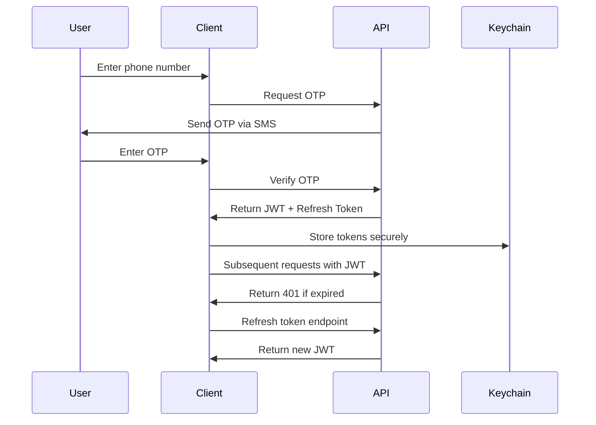
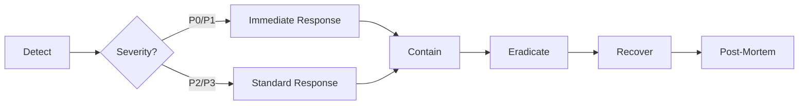

# Security Documentation

> **Version**: 3.0.0  
> **Last Updated**: 2026-09-27  
> **Status**: Production Ready ✅  
**Security Contact**: security@chatapp.com  
**PGP Key**: Available on request

## Table of Contents

- [Security Philosophy](#security-philosophy)
- [Threat Model](#threat-model)
- [Security Architecture](#security-architecture)
- [Authentication & Authorization](#authentication--authorization)
- [Data Protection](#data-protection)
- [Network Security](#network-security)
- [Device Security](#device-security)
- [Vulnerability Management](#vulnerability-management)
- [Security Testing](#security-testing)
- [Incident Response](#incident-response)
- [Compliance](#compliance)
- [Security Checklist](#security-checklist)

---

## Security Philosophy

ChatApp implements **defense-in-depth** security across all layers:

```
┌─────────────────────────────────────────┐
│           Application Layer             │
│  - Input Validation (Zod)               │
│  - Authorization Checks                  │
│  - Rate Limiting                         │
└─────────────────────────────────────────┘
                  ↓
┌─────────────────────────────────────────┐
│            Session Layer                 │
│  - JWT + Refresh Tokens                  │
│  - Biometric Authentication              │
│  - Keychain/Keystore Storage             │
└─────────────────────────────────────────┘
                  ↓
┌─────────────────────────────────────────┐
│            Network Layer                 │
│  - SSL Pinning                           │
│  - Certificate Validation                │
│  - HTTPS Only                            │
└─────────────────────────────────────────┘
                  ↓
┌─────────────────────────────────────────┐
│            Device Layer                  │
│  - Jailbreak/Root Detection              │
│  - Device Integrity Checks               │
│  - Secure Enclave / Keystore             │
└─────────────────────────────────────────┘
```

### Core Principles

| Principle | Implementation |
|-----------|----------------|
| **Least Privilege** | Minimal permissions, scoped tokens |
| **Fail Secure** | Errors default to secure state |
| **Defense in Depth** | Multiple overlapping security controls |
| **Secure by Default** | Safe defaults, opt-in for risky features |
| **Observability** | Comprehensive logging and monitoring |
| **Transparency** | Clear security policies, open communication |

---

## Threat Model

### Threat Actors

| Actor | Capability | Intent | Risk Level |
|-------|-----------|--------|------------|
| **Network Attacker** | MITM, packet sniffing | Intercept messages | High |
| **Malicious App** | Access device storage | Steal credentials | Medium |
| **Compromised Device** | Root/Jailbreak access | Full data access | High |
| **Insider Threat** | Backend access | Data exfiltration | Medium |
| **Automated Scanner** | Vulnerability scanning | Find exploits | Low |

### Attack Vectors

| Vector | Mitigation | Status |
|--------|-----------|--------|
| **Man-in-the-Middle** | SSL Pinning + Certificate Validation | ✅ Implemented |
| **Data Exfiltration** | Encrypted Storage + Keychain | ✅ Implemented |
| **Credential Theft** | Biometric Auth + Keychain | ✅ Implemented |
| **Message Interception** | E2E Encryption (planned) | 🔄 Planned |
| **Replay Attacks** | Timestamp + Nonce validation | ✅ Implemented |
| **Injection Attacks** | Zod validation + Parameterized queries | ✅ Implemented |
| **Denial of Service** | Rate limiting + Circuit breakers | ✅ Implemented |

---

## Security Architecture

### Security Layers

```typescript
// client/src/security/SecurityManager.ts
export class SecurityManager {
  private keychain: KeychainService;
  private sslPinning: SSLPinningService;
  private deviceSecurity: DeviceSecurityService;
  private crypto: CryptoService;

  async initialize(): Promise<void> {
    // 1. Check device security
    const isSecure = await this.deviceSecurity.isSecure();
    if (!isSecure) {
      throw new SecurityError('Device security check failed');
    }

    // 2. Initialize secure storage
    await this.keychain.initialize();

    // 3. Setup SSL pinning
    await this.sslPinning.initialize();

    // 4. Initialize crypto
    await this.crypto.initialize();
  }

  async storeSecureData(key: string, data: string): Promise<void> {
    // Encrypt before storing
    const encrypted = await this.crypto.encrypt(data);
    await this.keychain.setItem(key, encrypted);
  }
}
```

### Security Components

| Component | Purpose | Implementation |
|-----------|---------|---------------|
| **KeychainService** | Secure credential storage | `react-native-keychain` |
| **SSLPinningService** | Certificate validation | `react-native-ssl-pinning` |
| **DeviceSecurity** | Jailbreak/root detection | Custom implementation |
| **CryptoService** | Encryption/decryption | `expo-crypto` + AES-256-GCM |
| **BiometricAuth** | FaceID/TouchID/FaceAuth | `expo-local-authentication` |
| **SecureStorage** | Encrypted MMKV wrapper | Custom AES encryption |

---

## Authentication & Authorization

### Authentication Flow



### Token Management

```typescript
// Token refresh with exponential backoff
export class TokenManager {
  private refreshPromise: Promise<string> | null = null;

  async getValidToken(): Promise<string> {
    const token = await this.getStoredToken();
    if (!this.isExpired(token)) {
      return token;
    }

    // Prevent concurrent refresh requests
    if (!this.refreshPromise) {
      this.refreshPromise = this.refreshToken();
    }

    return await this.refreshPromise;
  }

  private async refreshToken(): Promise<string> {
    try {
      const newToken = await this.api.refreshToken();
      await this.storeToken(newToken);
      return newToken;
    } finally {
      this.refreshPromise = null;
    }
  }
}
```

### Authorization

```typescript
// Role-based access control
export enum UserRole {
  USER = 'user',
  ADMIN = 'admin',
  MODERATOR = 'moderator',
}

export const Permissions = {
  [UserRole.USER]: ['send_message', 'edit_own_message', 'delete_own_message'],
  [UserRole.MODERATOR]: ['send_message', 'delete_any_message', 'ban_user'],
  [UserRole.ADMIN]: ['*'], // All permissions
} as const;

export const hasPermission = (role: UserRole, permission: string): boolean => {
  const rolePermissions = Permissions[role];
  return rolePermissions.includes('*') || rolePermissions.includes(permission);
};
```

---

## Data Protection

### Encryption Strategy

| Data Type | At Rest | In Transit | Notes |
|-----------|---------|------------|-------|
| **Messages** | AES-256-GCM | TLS 1.3 | E2E encryption (planned) |
| **Credentials** | Keychain | TLS 1.3 | Never stored in app |
| **Profile Data** | Encrypted MMKV | TLS 1.3 | Server-side encryption |
| **Media Files** | AES-256-GCM | TLS 1.3 | Encrypted before upload |

### Secure Storage

```typescript
// Encrypted MMKV wrapper
export class SecureMMKV {
  private encryptionKey: string;

  async initialize(userId: string): Promise<void> {
    // Derive encryption key from user credentials
    this.encryptionKey = await this.deriveKey(userId);
  }

  async set(key: string, value: string): Promise<void> {
    const encrypted = await this.encrypt(value, this.encryptionKey);
    MMKV.setItem(key, encrypted);
  }

  async get(key: string): Promise<string | null> {
    const encrypted = MMKV.getItem(key);
    if (!encrypted) return null;
    return await this.decrypt(encrypted, this.encryptionKey);
  }
}
```

### Data Retention

| Data Type | Retention Period | Deletion Policy |
|-----------|-----------------|-----------------|
| **Messages** | User-controlled | Delete on request |
| **Media** | 30 days after deletion | Auto-delete |
| **Logs** | 90 days | Auto-delete |
| **Backups** | 7 days | Auto-delete |
| **Analytics** | 2 years | Anonymized |

---

## Network Security

### SSL Pinning

```typescript
// client/src/security/sslPinningConfig.ts
export const SSL_PINNING_CONFIG = {
  'api.chatapp.com': [
    'sha256/AAAAAAAAAAAAAAAAAAAAAAAAAAAAAAAAAAAAAAAAAAA=',
    'sha256/BBBBBBBBBBBBBBBBBBBBBBBBBBBBBBBBBBBBBBBBBBBBB=',
  ],
  'ws.chatapp.com': [
    'sha256/AAAAAAAAAAAAAAAAAAAAAAAAAAAAAAAAAAAAAAAAAAA=',
    'sha256/BBBBBBBBBBBBBBBBBBBBBBBBBBBBBBBBBBBBBBBBBBBBB=',
  ],
};

export class SSLPinningService {
  validateCertificate(hostname: string, certificate: string): boolean {
    const expectedHashes = SSL_PINNING_CONFIG[hostname];
    if (!expectedHashes) return false;

    const certHash = this.calculateCertificateHash(certificate);
    return expectedHashes.includes(certHash);
  }
}
```

### Network Security Policy

```typescript
// client/src/core/networking/ApiClient.ts
export class ApiClient {
  private baseUrl: string;
  private wsUrl: string;

  async request(endpoint: string, options: RequestOptions): Promise<Response> {
    // 1. Validate URL
    if (!this.isAllowedEndpoint(endpoint)) {
      throw new SecurityError('Endpoint not allowed');
    }

    // 2. Add security headers
    const headers = {
      ...options.headers,
      'X-Request-Signature': await this.signRequest(options),
      'X-Device-ID': await DeviceInfo.getUniqueId(),
    };

    // 3. Make request with timeout
    const response = await fetch(`${this.baseUrl}${endpoint}`, {
      ...options,
      headers,
      timeout: 10000, // 10 second timeout
    });

    // 4. Validate response
    this.validateResponse(response);

    return response;
  }

  private isAllowedEndpoint(endpoint: string): boolean {
    const allowedPatterns = [
      '/api/v1/messages',
      '/api/v1/chats',
      '/api/v1/users',
      '/ws',
    ];

    return allowedPatterns.some(pattern => endpoint.startsWith(pattern));
  }
}
```

---

## Device Security

### Jailbreak/Root Detection

```typescript
// client/src/security/deviceSecurity.ts
export class DeviceSecurityService {
  async isSecure(): Promise<boolean> {
    const checks = await Promise.all([
      this.checkJailbreak(),
      this.checkDebugMode(),
      this.checkIntegrity(),
      this.checkEmulator(),
    ]);

    return checks.every(result => result === true);
  }

  private async checkJailbreak(): Promise<boolean> {
    // iOS: Check for Cydia, MobileSubstrate
    // Android: Check for su, magisk, busybox
    const jailbreakIndicators = [
      '/Applications/Cydia.app',
      '/bin/bash',
      '/usr/sbin/sshd',
      '/etc/apt',
      'su',
      'magisk',
    ];

    for (const indicator of jailbreakIndicators) {
      if (await FileSystem.existsAsync(indicator)) {
        return false;
      }
    }

    return true;
  }

  private async checkDebugMode(): Promise<boolean> {
    // Check if app is running in debug mode
    if (__DEV__) {
      return false;
    }

    // Check for debugger attachment
    const isDebuggerAttached = await this.isDebuggerAttached();
    return !isDebuggerAttached;
  }
}
```

### Device Integrity

```typescript
// Verify app signature
export async function verifyAppSignature(): Promise<boolean> {
  if (Platform.OS === 'ios') {
    // Verify code signature on iOS
    return await this.verifyIOSSignature();
  } else if (Platform.OS === 'android') {
    // Verify APK signature on Android
    return await this.verifyAndroidSignature();
  }
  return true; // Web doesn't have this check
}
```

---

## Vulnerability Management

### Current Status

| Vulnerability | Package | Severity | Status | Date |
|---------------|---------|----------|--------|------|
| Drizzle ORM SQL Injection | drizzle-orm@0.45.2 | High | ✅ Fixed | 2026-09-06 |
| Esbuild Dev Server | esbuild@0.28.2 | Medium | ✅ Fixed | 2026-09-06 |
| Qs Array Limit Bypass | qs@6.15.3 | Medium | ⚠️ Accepted | 2026-09-07 |
| UUID Buffer Bounds | uuid@8.3.2 | Medium | ⚠️ Accepted | 2026-09-07 |
| decode-uri-component DoS | decode-uri-component@0.2.2 | Medium | ⚠️ Accepted | 2026-09-07 |
| PostCSS XSS/Path Traversal | postcss (transitive) | High | ⚠️ Accepted | 2026-09-07 |
| Image-Size Infinite Loop | image-size (transitive) | High | ⚠️ Accepted | 2026-09-07 |

### Accepted Risks

| ID | Vulnerability | Severity | Rationale | Mitigation | Review Date |
|----|---------------|----------|-----------|------------|-------------|
| RA-001 | decode-uri-component DoS | Medium | Breaking change risk with @react-navigation | Monitor for patch | 2026-12-07 |
| RA-002 | PostCSS XSS/Path Traversal | High | Requires expo@57 upgrade (breaking) | Plan major upgrade | 2026-12-07 |
| RA-003 | Image-Size Infinite Loop | High | Requires expo@57 upgrade (breaking) | Plan major upgrade | 2026-12-07 |

### Remediation Plan

1. **Immediate** (Completed)
   - ✅ Updated drizzle-orm to 0.45.2
   - ✅ Updated esbuild to 0.28.2

2. **Short-term** (Q4 2026)
   - ⚠️ Monitor transitive dependencies for patches
   - ⚠️ Evaluate alternative packages
   - ⚠️ Implement npm overrides where possible

3. **Long-term** (Q1 2027)
   - 🔄 Plan major React Native/Expo upgrade to v57+
   - 🔄 Remove vulnerable transitive dependencies
   - 🔄 Implement automated dependency updates

---

## Security Testing

### Automated Security Tests

```typescript
// client/src/security/__tests__/sslPinningConfig.test.ts
describe('SSL Pinning', () => {
  it('should validate known certificates', () => {
    const service = new SSLPinningService();
    const validCert = generateTestCertificate('api.chatapp.com');

    expect(service.validateCertificate('api.chatapp.com', validCert)).toBe(true);
  });

  it('should reject unknown certificates', () => {
    const service = new SSLPinningService();
    const invalidCert = generateTestCertificate('evil.com');

    expect(service.validateCertificate('api.chatapp.com', invalidCert)).toBe(false);
  });
});
```

### Security Test Coverage

| Test Type | Tool | Frequency |
|-----------|------|-----------|
| **Dependency Audit** | `npm audit` | Every commit |
| **SAST** | ESLint security plugins | Every commit |
| **DAST** | OWASP ZAP | Weekly |
| **Penetration Testing** | Internal team | Quarterly |
| **Code Review** | Manual review | Every PR |

---

## Incident Response

### Incident Severity Levels

| Level | Description | Response Time | Examples |
|-------|-------------|---------------|----------|
| **P0 - Critical** | Active exploitation, data breach | < 15 minutes | E2E encryption failure, credential leak |
| **P1 - High** | Potential exploitation, service down | < 1 hour | Authentication bypass, XSS |
| **P2 - Medium** | Limited impact, no exploitation | < 4 hours | CSRF, information disclosure |
| **P3 - Low** | Minimal impact, no exploitation | < 24 hours | Security misconfiguration |

### Incident Response Process



### Communication Plan

1. **Internal**: Slack #security-incidents
2. **Users**: In-app notification + email
3. **Regulatory**: GDPR breach notification (72h)
4. **Public**: Security advisory (if needed)

---

## Compliance

### Standards & Regulations

| Standard | Scope | Status |
|----------|-------|--------|
| **GDPR** | EU user data | ✅ Compliant |
| **CCPA/CPRA** | California user data | ✅ Compliant |
| **SOC 2 Type II** | Service organization controls | 🔄 In Progress |
| **HIPAA** | Health data (optional) | 🔄 Planned |
| **ISO 27001** | Information security | 🔄 Planned |

### Data Protection

- **Privacy by Design**: Default settings protect user privacy
- **Data Minimization**: Collect only necessary data
- **User Control**: Export, delete, correct data
- **Transparency**: Clear privacy policy, data usage disclosure
- **Security**: Encryption, access controls, audit logs

---

## Security Checklist

### Before Every Release

- [ ] **Dependencies**: `npm audit` shows no high/critical vulnerabilities
- [ ] **Secrets**: No secrets in code, environment variables validated
- [ ] **Input Validation**: All inputs validated with Zod
- [ ] **Authentication**: JWT tokens properly validated
- [ ] **Authorization**: Permission checks enforced
- [ ] **Network**: HTTPS only, SSL pinning verified
- [ ] **Storage**: Sensitive data in Keychain only
- [ ] **Logging**: No sensitive data in logs
- [ ] **Error Handling**: No stack traces exposed to users
- [ ] **Testing**: Security tests pass

### Before Production Deployment

- [ ] **Penetration Testing**: Internal security review completed
- [ ] **Code Review**: Security-focused review by security team
- [ ] **Dependency Audit**: All dependencies reviewed
- [ ] **Infrastructure**: Server security hardened
- [ ] **Monitoring**: Sentry alerts configured
- [ ] **Incident Plan**: Response team notified, runbooks ready
- [ ] **Compliance**: Legal review completed

---

## Security Resources

### Internal

- **Security Team**: security@chatapp.com
- **Incident Response**: #security-incidents (Slack)
- **Security Docs**: [SECURITY.md](SECURITY.md)
- **Vulnerability Reports**: [GitHub Security Advisories](https://github.com/your-org/chatapp/security/advisories)

### External

- [OWASP Mobile Top 10](https://owasp.org/www-project-mobile-top-10/)
- [NIST Cybersecurity Framework](https://www.nist.gov/cyberframework)
- [CWE/SANS Top 25](https://cwe.mitre.org/top25/)
- [React Native Security](https://reactnative.dev/docs/security)

---

## Responsible Disclosure

We take security seriously. If you discover a vulnerability:

1. **Email**: security@chatapp.com
2. **PGP**: Use our PGP key (available on request)
3. **Details**: Include reproduction steps, impact assessment
4. **Timeline**: We'll respond within 48 hours

**Bug Bounty**: Critical vulnerabilities eligible for bounty (amount based on severity)

---

**Maintained by**: Security Team  
**Review Cycle**: Monthly  
**Next Review**: October 2026  
**Classification**: Internal Use
