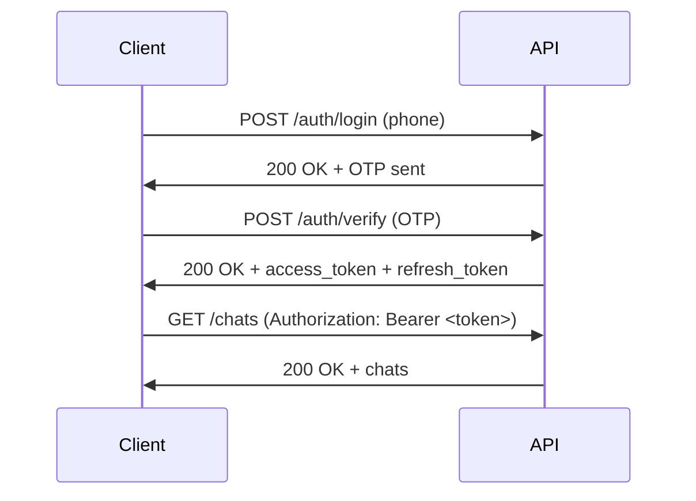

# API Reference

> **Version**: 3.0.0  
> **Last Updated**: 2026-09-27  
> **Base URL**: `https://api.chatapp.com/v1`  
> **WebSocket URL**: `wss://ws.chatapp.com/ws`  
**Authentication**: Bearer JWT (`Authorization: Bearer <token>`)

## Table of Contents

- [Authentication](#authentication)
- [REST API Endpoints](#rest-api-endpoints)
- [WebSocket Events](#websocket-events)
- [Error Codes](#error-codes)
- [Rate Limiting](#rate-limiting)
- [Pagination](#pagination)
- [Examples](#examples)

---

## Authentication

### JWT Token Flow



### Token Refresh

```typescript
// Automatic token refresh
async function getValidToken(): Promise<string> {
  const token = await getStoredToken();
  if (!isExpired(token)) return token;

  const refreshToken = await getStoredRefreshToken();
  const response = await fetch('/auth/refresh', {
    method: 'POST',
    body: JSON.stringify({ refreshToken }),
  });

  const { access_token } = await response.json();
  await storeToken(access_token);
  return access_token;
}
```

---

## REST API Endpoints

### Base URL

```
Production: https://api.chatapp.com/v1
Staging: https://staging.chatapp.com/v1
```

### Common Headers

```http
Authorization: Bearer <access_token>
Content-Type: application/json
Accept: application/json
X-Device-ID: <device_unique_id>
X-App-Version: 3.0.0
```

### Endpoints

#### Authentication

```http
POST /auth/login
```
Request OTP for phone number.

**Request**:
```json
{
  "phone": "+1234567890",
  "deviceId": "device-uuid"
}
```

**Response** (200):
```json
{
  "success": true,
  "message": "OTP sent successfully",
  "expiresIn": 300
}
```

---

```http
POST /auth/verify
```
Verify OTP and get tokens.

**Request**:
```json
{
  "phone": "+1234567890",
  "otp": "123456",
  "deviceId": "device-uuid"
}
```

**Response** (200):
```json
{
  "success": true,
  "data": {
    "accessToken": "eyJhbGciOiJIUzI1NiIsInR5cCI6IkpXVCJ9...",
    "refreshToken": "eyJhbGciOiJIUzI1NiIsInR5cCI6IkpXVCJ9...",
    "expiresIn": 3600,
    "user": {
      "id": "user-123",
      "name": "John Doe",
      "phone": "+1234567890",
      "avatar": "https://...",
      "isOnline": true
    }
  }
}
```

---

```http
POST /auth/refresh
```
Refresh access token.

**Request**:
```json
{
  "refreshToken": "eyJhbGciOiJIUzI1NiIsInR5cCI6IkpXVCJ9..."
}
```

**Response** (200):
```json
{
  "success": true,
  "data": {
    "accessToken": "eyJhbGciOiJIUzI1NiIsInR5cCI6IkpXVCJ9...",
    "expiresIn": 3600
  }
}
```

---

#### Chats

```http
GET /chats
```
Get user's chats.

**Query Parameters**:
- `limit` (optional): Number of chats to return (default: 50, max: 100)
- `offset` (optional): Pagination offset (default: 0)
- `sort` (optional): `lastActivity` | `createdAt` (default: `lastActivity`)

**Response** (200):
```json
{
  "success": true,
  "data": [
    {
      "id": "chat_user-1_user-2",
      "type": "private",
      "participantIds": ["user-1", "user-2"],
      "participantId": "user-2",
      "lastMessage": {
        "id": "msg-123",
        "chatId": "chat_user-1_user-2",
        "senderId": "user-2",
        "content": { "type": "text", "text": "Hello!" },
        "timestamp": "2026-09-27T10:00:00Z",
        "status": "delivered"
      },
      "unreadCount": 2,
      "isPinned": false,
      "isMuted": false,
      "isArchived": false,
      "lastActivity": "2026-09-27T10:00:00Z",
      "createdAt": "2026-09-20T08:00:00Z",
      "updatedAt": "2026-09-27T10:00:00Z"
    }
  ],
  "pagination": {
    "total": 25,
    "limit": 50,
    "offset": 0,
    "hasMore": false
  }
}
```

---

```http
GET /chats/:id
```
Get specific chat details.

**Response** (200):
```json
{
  "success": true,
  "data": {
    "id": "chat_user-1_user-2",
    "type": "private",
    "participantIds": ["user-1", "user-2"],
    "lastMessage": { /* ... */ },
    "unreadCount": 2,
    "isPinned": false,
    "isMuted": false,
    "isArchived": false,
    "lastActivity": "2026-09-27T10:00:00Z",
    "createdAt": "2026-09-20T08:00:00Z",
    "updatedAt": "2026-09-27T10:00:00Z"
  }
}
```

---

```http
POST /chats
```
Create a new chat.

**Request**:
```json
{
  "type": "private",
  "participantIds": ["user-1", "user-2"]
}
```

**Response** (201):
```json
{
  "success": true,
  "data": {
    "id": "chat_user-1_user-2",
    "type": "private",
    "participantIds": ["user-1", "user-2"],
    "unreadCount": 0,
    "isPinned": false,
    "isMuted": false,
    "isArchived": false,
    "lastActivity": "2026-09-27T10:00:00Z",
    "createdAt": "2026-09-27T10:00:00Z",
    "updatedAt": "2026-09-27T10:00:00Z"
  }
}
```

---

#### Messages

```http
GET /chats/:chatId/messages
```
Get messages for a chat.

**Query Parameters**:
- `limit` (optional): Number of messages (default: 50, max: 100)
- `before` (optional): Message ID to paginate before
- `after` (optional): Message ID to paginate after

**Response** (200):
```json
{
  "success": true,
  "data": [
    {
      "id": "msg-123",
      "chatId": "chat_user-1_user-2",
      "senderId": "user-2",
      "content": {
        "type": "text",
        "text": "Hello!"
      },
      "timestamp": "2026-09-27T10:00:00Z",
      "status": "delivered",
      "reactions": [
        {
          "userId": "user-1",
          "emoji": "👍",
          "createdAt": "2026-09-27T10:01:00Z"
        }
      ],
      "edited": false,
      "editedAt": null
    }
  ],
  "pagination": {
    "hasMore": true,
    "nextCursor": "msg-124"
  }
}
```

---

```http
POST /chats/:chatId/messages
```
Send a message.

**Request**:
```json
{
  "content": {
    "type": "text",
    "text": "Hello!"
  },
  "replyToId": "msg-122" // optional
}
```

**Response** (201):
```json
{
  "success": true,
  "data": {
    "id": "msg-124",
    "chatId": "chat_user-1_user-2",
    "senderId": "user-1",
    "content": {
      "type": "text",
      "text": "Hello!"
    },
    "timestamp": "2026-09-27T10:02:00Z",
    "status": "sent",
    "reactions": [],
    "edited": false,
    "editedAt": null
  }
}
```

---

```http
PUT /messages/:id
```
Update a message (edit).

**Request**:
```json
{
  "content": {
    "type": "text",
    "text": "Hello! (edited)"
  }
}
```

**Response** (200):
```json
{
  "success": true,
  "data": {
    "id": "msg-124",
    "chatId": "chat_user-1_user-2",
    "senderId": "user-1",
    "content": {
      "type": "text",
      "text": "Hello! (edited)"
    },
    "timestamp": "2026-09-27T10:02:00Z",
    "status": "sent",
    "reactions": [],
    "edited": true,
    "editedAt": "2026-09-27T10:05:00Z"
  }
}
```

---

```http
DELETE /messages/:id
```
Delete a message.

**Response** (200):
```json
{
  "success": true,
  "message": "Message deleted"
}
```

---

#### Users

```http
GET /users/me
```
Get current user profile.

**Response** (200):
```json
{
  "success": true,
  "data": {
    "id": "user-1",
    "name": "John Doe",
    "phone": "+1234567890",
    "avatar": "https://...",
    "isOnline": true,
    "lastSeen": "2026-09-27T10:00:00Z",
    "createdAt": "2026-09-20T08:00:00Z",
    "updatedAt": "2026-09-27T10:00:00Z"
  }
}
```

---

```http
PUT /users/me
```
Update current user profile.

**Request**:
```json
{
  "name": "John Doe Updated",
  "avatar": "https://..."
}
```

**Response** (200):
```json
{
  "success": true,
  "data": {
    "id": "user-1",
    "name": "John Doe Updated",
    "phone": "+1234567890",
    "avatar": "https://...",
    "isOnline": true,
    "updatedAt": "2026-09-27T10:30:00Z"
  }
}
```

---

## WebSocket Events

### Connection

```typescript
// Connect to WebSocket
const ws = new WebSocket('wss://ws.chatapp.com/ws');

// Authenticate
ws.send(JSON.stringify({
  type: 'auth',
  payload: { token: 'eyJhbGciOiJIUzI1NiIsInR5cCI6IkpXVCJ9...' }
}));
```

### Client → Server Events

| Event | Payload | Description |
|-------|---------|-------------|
| `auth` | `{ token }` | Authenticate connection |
| `message:send` | `{ chatId, content, replyToId? }` | Send message |
| `message:edit` | `{ messageId, content }` | Edit message |
| `message:delete` | `{ messageId }` | Delete message |
| `reaction:add` | `{ messageId, emoji }` | Add reaction |
| `reaction:remove` | `{ messageId, emoji }` | Remove reaction |
| `typing:start` | `{ chatId }` | Start typing indicator |
| `typing:stop` | `{ chatId }` | Stop typing indicator |
| `read:update` | `{ chatId, lastReadMessageId }` | Update read receipt |

### Server → Client Events

| Event | Payload | Description |
|-------|---------|-------------|
| `message:new` | `{ message }` | New message received |
| `message:updated` | `{ message }` | Message edited |
| `message:deleted` | `{ messageId }` | Message deleted |
| `reaction:added` | `{ messageId, reaction }` | Reaction added |
| `reaction:removed` | `{ messageId, userId, emoji }` | Reaction removed |
| `typing:started` | `{ chatId, userId }` | User started typing |
| `typing:stopped` | `{ chatId, userId }` | User stopped typing |
| `read:updated` | `{ chatId, userId, lastReadMessageId }` | Read receipt updated |
| `chat:updated` | `{ chat }` | Chat updated |
| `presence:update` | `{ userId, isOnline, lastSeen }` | User presence changed |

### Example WebSocket Client

```typescript
class ChatWebSocketClient {
  private ws: WebSocket | null = null;
  private reconnectAttempts = 0;
  private maxReconnectAttempts = 10;

  connect(token: string): void {
    this.ws = new WebSocket('wss://ws.chatapp.com/ws');

    this.ws.onopen = () => {
      this.send({ type: 'auth', payload: { token } });
      this.reconnectAttempts = 0;
    };

    this.ws.onmessage = (event) => {
      const data = JSON.parse(event.data);
      this.handleMessage(data);
    };

    this.ws.onclose = () => {
      this.scheduleReconnect(token);
    };
  }

  private scheduleReconnect(token: string): void {
    if (this.reconnectAttempts >= this.maxReconnectAttempts) {
      console.error('Max reconnection attempts reached');
      return;
    }

    const delay = Math.min(1000 * Math.pow(2, this.reconnectAttempts), 30000);
    setTimeout(() => this.connect(token), delay);
    this.reconnectAttempts++;
  }

  send(data: unknown): void {
    if (this.ws?.readyState === WebSocket.OPEN) {
      this.ws.send(JSON.stringify(data));
    }
  }
}
```

---

## Error Codes

### HTTP Status Codes

| Code | Meaning | Action |
|------|---------|--------|
| `200` | OK | Success |
| `201` | Created | Resource created |
| `400` | Bad Request | Invalid request body |
| `401` | Unauthorized | Invalid/missing token |
| `403` | Forbidden | Insufficient permissions |
| `404` | Not Found | Resource not found |
| `409` | Conflict | Resource conflict |
| `422` | Validation Error | Invalid input |
| `429` | Too Many Requests | Rate limited |
| `500` | Internal Server Error | Server error |
| `503` | Service Unavailable | Maintenance |

### Error Response Format

```json
{
  "success": false,
  "error": {
    "code": "VALIDATION_ERROR",
    "message": "Invalid phone number format",
    "details": [
      {
        "field": "phone",
        "message": "Phone number must be in E.164 format",
        "code": "INVALID_FORMAT"
      }
    ]
  }
}
```

### Error Codes

| Code | Description |
|------|-------------|
| `VALIDATION_ERROR` | Invalid input data |
| `AUTHENTICATION_ERROR` | Invalid or expired token |
| `AUTHORIZATION_ERROR` | Insufficient permissions |
| `NOT_FOUND` | Resource not found |
| `CONFLICT` | Resource conflict |
| `RATE_LIMIT_EXCEEDED` | Too many requests |
| `INTERNAL_ERROR` | Server error |
| `SERVICE_UNAVAILABLE` | Service temporarily unavailable |

---

## Rate Limiting

### Limits

| Endpoint Type | Limit | Window |
|---------------|-------|--------|
| **Authentication** | 5 requests | 15 minutes |
| **Message Send** | 100 requests | 1 minute |
| **General API** | 1000 requests | 1 hour |
| **WebSocket** | 10 connections | 1 minute |

### Rate Limit Headers

```http
X-RateLimit-Limit: 1000
X-RateLimit-Remaining: 995
X-RateLimit-Reset: 1632870000
```

### Handling Rate Limits

```typescript
if (response.status === 429) {
  const retryAfter = response.headers.get('X-RateLimit-Reset');
  const delay = retryAfter ? parseInt(retryAfter) * 1000 : 60000;

  await sleep(delay);
  // Retry request
}
```

---

## Pagination

### Offset-Based Pagination

```http
GET /chats?limit=20&offset=40
```

**Response**:
```json
{
  "data": [...],
  "pagination": {
    "total": 100,
    "limit": 20,
    "offset": 40,
    "hasMore": true
  }
}
```

### Cursor-Based Pagination

```http
GET /chats/:chatId/messages?limit=50&before=msg-123
```

**Response**:
```json
{
  "data": [...],
  "pagination": {
    "hasMore": true,
    "nextCursor": "msg-100",
    "prevCursor": "msg-50"
  }
}
```

---

## Examples

### cURL Examples

```bash
# Login
curl -X POST https://api.chatapp.com/v1/auth/login \
  -H "Content-Type: application/json" \
  -d '{"phone":"+1234567890","deviceId":"device-uuid"}'

# Verify OTP
curl -X POST https://api.chatapp.com/v1/auth/verify \
  -H "Content-Type: application/json" \
  -d '{"phone":"+1234567890","otp":"123456","deviceId":"device-uuid"}'

# Get chats
curl https://api.chatapp.com/v1/chats \
  -H "Authorization: Bearer <token>"

# Send message
curl -X POST https://api.chatapp.com/v1/chats/chat-123/messages \
  -H "Authorization: Bearer <token>" \
  -H "Content-Type: application/json" \
  -d '{"content":{"type":"text","text":"Hello!"}}'
```

### TypeScript Client

```typescript
class ChatApiClient {
  private baseUrl = 'https://api.chatapp.com/v1';
  private token: string | null = null;

  async login(phone: string): Promise<void> {
    await fetch(`${this.baseUrl}/auth/login`, {
      method: 'POST',
      headers: { 'Content-Type': 'application/json' },
      body: JSON.stringify({ phone, deviceId: await getDeviceId() }),
    });
  }

  async verifyOtp(phone: string, otp: string): Promise<User> {
    const response = await fetch(`${this.baseUrl}/auth/verify`, {
      method: 'POST',
      headers: { 'Content-Type': 'application/json' },
      body: JSON.stringify({ phone, otp, deviceId: await getDeviceId() }),
    });

    const data = await response.json();
    this.token = data.data.accessToken;
    return data.data.user;
  }

  async getChats(limit = 50, offset = 0): Promise<Chat[]> {
    const response = await fetch(
      `${this.baseUrl}/chats?limit=${limit}&offset=${offset}`,
      {
        headers: { Authorization: `Bearer ${this.token}` },
      }
    );

    const data = await response.json();
    return data.data;
  }

  async sendMessage(chatId: string, text: string): Promise<Message> {
    const response = await fetch(
      `${this.baseUrl}/chats/${chatId}/messages`,
      {
        method: 'POST',
        headers: {
          Authorization: `Bearer ${this.token}`,
          'Content-Type': 'application/json',
        },
        body: JSON.stringify({ content: { type: 'text', text } }),
      }
    );

    const data = await response.json();
    return data.data;
  }
}
```

---

## SDKs & Libraries

### Official SDKs

| Platform | SDK | Installation |
|----------|-----|--------------|
| **React Native** | `@chatapp/sdk-react-native` | `npm install @chatapp/sdk-react-native` |
| **Node.js** | `@chatapp/sdk-node` | `npm install @chatapp/sdk-node` |
| **Python** | `chatapp-python` | `pip install chatapp-python` |

### Community SDKs

- [JavaScript/Browser](https://github.com/chatapp/js-sdk)
- [Swift/iOS](https://github.com/chatapp/swift-sdk)
- [Kotlin/Android](https://github.com/chatapp/kotlin-sdk)

---

## Support

- **API Status**: [status.chatapp.com](https://status.chatapp.com)
- **API Issues**: [GitHub Issues](https://github.com/your-org/chatapp/issues)
- **Developer Support**: developers@chatapp.com

---

**Maintained by**: Backend Team  
**Review Cycle**: Monthly  
**Next Review**: October 2026  
**Specification**: [OpenAPI 3.0](https://swagger.io/specification/)
