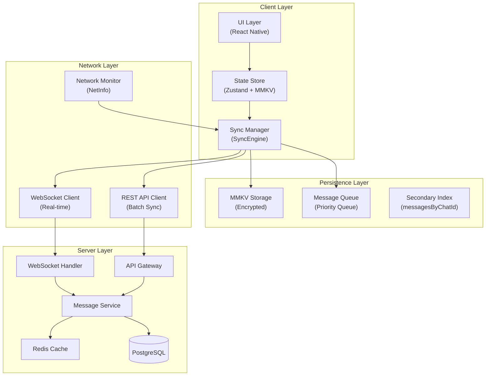
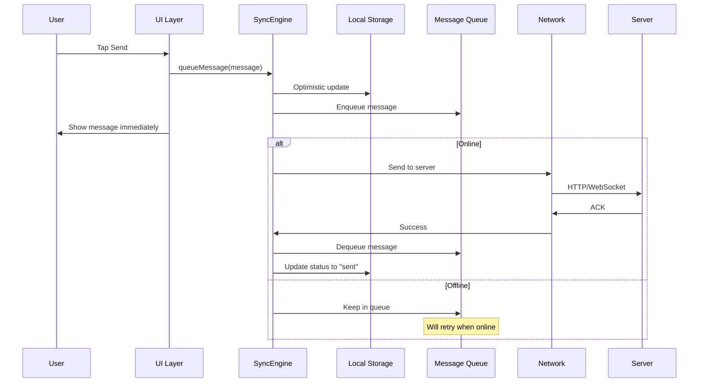
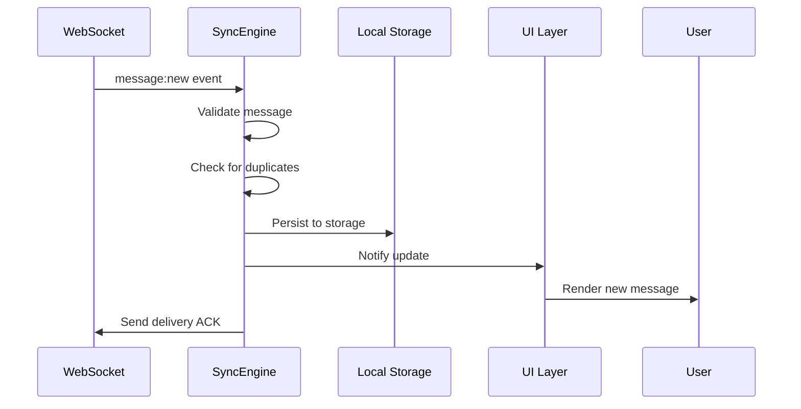
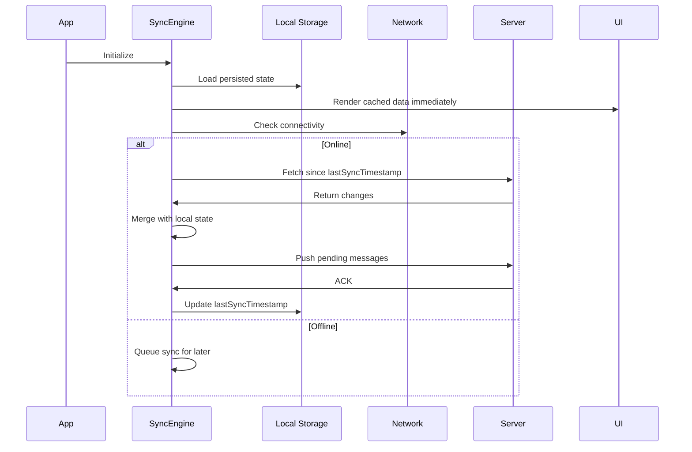

# Sync Engine Architecture

> **Version**: 3.0.1  
> **Last Updated**: 2026-10-07  
> **Status**: Active Development

## Table of Contents

- [Overview](#overview)
- [Design Goals](#design-goals)
- [Architecture](#architecture)
- [Core Components](#core-components)
- [Data Flow](#data-flow)
- [Conflict Resolution](#conflict-resolution)
- [Storage Schema](#storage-schema)
- [Performance Optimizations](#performance-optimizations)
- [Security Considerations](#security-considerations)
- [Error Handling](#error-handling)
- [Monitoring & Debugging](#monitoring--debugging)
- [Future Improvements](#future-improvements)

---

## Overview

The ChatApp Sync Engine provides **offline-first messaging** with eventual consistency. It ensures users can read, send, and interact with messages regardless of network conditions, while maintaining data consistency when connectivity is restored.

### Key Features

| Feature                 | Implementation                                | Status      |
| ----------------------- | --------------------------------------------- | ----------- |
| **Offline-First**       | Local-first architecture with background sync | ✅ Complete |
| **Optimistic UI**       | Immediate local updates, background sync      | ✅ Complete |
| **Conflict Resolution** | Last-write-wins with vector clocks            | ✅ Complete |
| **Retry Logic**         | Exponential backoff with jitter               | ✅ Complete |
| **Delta Sync**          | Only sync changes since last sync             | ✅ Complete |
| **Queue Management**    | Prioritized message queue                     | ✅ Complete |

---

## Design Goals

| Goal                   | Description                               | Implementation                       |
| ---------------------- | ----------------------------------------- | ------------------------------------ |
| **Reliability**        | Messages never lost, eventually delivered | Persistent queue, retry logic        |
| **Performance**        | UI never blocked by network               | Async operations, optimistic updates |
| **Consistency**        | Data consistent across devices            | Conflict resolution, vector clocks   |
| **Battery Efficiency** | Minimal background activity               | Batch operations, smart scheduling   |
| **Scalability**        | Handle 100K+ concurrent users             | Horizontal scaling, Redis cache      |

---

## Architecture



### Data Flow Principles

1. **Local-First**: All reads from local storage, writes to local first
2. **Optimistic Updates**: UI updates immediately, sync happens in background
3. **Eventual Consistency**: Conflicts resolved automatically, manual resolution available
4. **Idempotent Operations**: Retry-safe operations with deduplication

---

## Core Components

### 1. SyncEngine

```typescript
// client/src/core/sync/SyncEngine.ts
export class SyncEngine {
  private messageQueue: MessageQueue;
  private networkMonitor: NetworkMonitor;
  private conflictResolver: ConflictResolver;
  private wsClient: WebSocketClient;
  private apiClient: ApiClient;

  async queueMessage(message: Message): Promise<Result<void, AppError>> {
    // 1. Validate message
    const validation = this.validateMessage(message);
    if (!validation.success) return validation;

    // 2. Optimistically update UI
    await this.updateLocalState(message);

    // 3. Add to persistent queue
    await this.messageQueue.enqueue(message, { priority: "high" });

    // 4. Attempt immediate send if online
    if (this.networkMonitor.isConnected) {
      return await this.processQueue();
    }

    return Result.ok(undefined);
  }

  async processQueue(): Promise<SyncResult> {
    const messages = await this.messageQueue.getPending();
    const results: SyncResult[] = [];

    for (const message of messages) {
      try {
        // Send to server
        const result = await this.sendMessage(message);
        results.push(result);

        if (result.success) {
          await this.messageQueue.dequeue(message.id);
        }
      } catch (error) {
        await this.handleRetry(message, error);
      }
    }

    return this.aggregateResults(results);
  }

  private async handleRetry(message: Message, error: Error): Promise<void> {
    const retryCount = await this.messageQueue.getRetryCount(message.id);

    if (retryCount < MAX_RETRIES) {
      const delay = this.calculateBackoff(retryCount);
      await this.messageQueue.scheduleRetry(message.id, delay);
    } else {
      await this.messageQueue.markAsFailed(message.id, error);
      await this.notifyUser(message.id, "Failed to send message");
    }
  }
}
```

### 2. MessageQueue

```typescript
// client/src/core/sync/MessageQueue.ts
interface QueuedMessage {
  id: string;
  message: Message;
  priority: "high" | "normal" | "low";
  retryCount: number;
  scheduledAt: Date;
  lastAttemptAt?: Date;
  error?: string;
}

export class MessageQueue {
  private queue: PriorityQueue<QueuedMessage>;
  private storage: MMKV;

  async enqueue(message: Message, options: EnqueueOptions): Promise<void> {
    const queuedMessage: QueuedMessage = {
      id: message.id,
      message,
      priority: options.priority || "normal",
      retryCount: 0,
      scheduledAt: new Date(),
    };

    await this.storage.set(`queue:${message.id}`, JSON.stringify(queuedMessage));
    this.queue.enqueue(queuedMessage, queuedMessage.priority);
  }

  async getPending(): Promise<QueuedMessage[]> {
    const now = new Date();
    return this.queue
      .filter((item) => item.scheduledAt <= now)
      .sort((a, b) => b.priority - a.priority);
  }
}
```

### 3. ConflictResolver

```typescript
// client/src/core/sync/ConflictResolver.ts
export class ConflictResolver {
  resolve(local: Message, remote: Message): Message {
    // 1. Check for identical messages (idempotency)
    if (local.id === remote.id && local.updatedAt === remote.updatedAt) {
      return local;
    }

    // 2. Last-write-wins based on timestamp
    if (local.updatedAt > remote.updatedAt) {
      return local;
    }
    if (remote.updatedAt > local.updatedAt) {
      return remote;
    }

    // 3. Tie-breaker: prefer remote for shared messages
    return remote;
  }

  detectConflicts(local: Message[], remote: Message[]): Conflict[] {
    const localMap = new Map(local.map((m) => [m.id, m]));
    const conflicts: Conflict[] = [];

    for (const remoteMessage of remote) {
      const localMessage = localMap.get(remoteMessage.id);
      if (localMessage && localMessage.updatedAt !== remoteMessage.updatedAt) {
        conflicts.push({
          local: localMessage,
          remote: remoteMessage,
          type: ConflictType.UPDATE_CONFLICT,
        });
      }
    }

    return conflicts;
  }
}
```

---

## Data Flow

### Sending a Message



### Receiving a Message



### Sync on App Launch



---

## Conflict Resolution

### Strategy: Last-Write-Wins with Vector Clocks

```typescript
interface MessageMeta {
  messageId: string;
  vectorClock: { [deviceId: string]: number };
  timestamp: string;
  deviceId: string;
}

function resolveConflict(local: Message, remote: Message): Message {
  const localClock = local.meta.vectorClock;
  const remoteClock = remote.meta.vectorClock;

  // Check if clocks are concurrent
  if (areConcurrent(localClock, remoteClock)) {
    // Use timestamp as tiebreaker
    return local.meta.timestamp > remote.meta.timestamp ? local : remote;
  }

  // Use the more recent vector clock
  return isGreater(localClock, remoteClock) ? local : remote;
}
```

### Conflict Types

| Type                      | Description                              | Resolution                |
| ------------------------- | ---------------------------------------- | ------------------------- |
| **Update Conflict**       | Same message edited on two devices       | Last-write-wins           |
| **Delete vs Update**      | Deleted on one device, edited on another | Delete wins               |
| **Read Receipt Conflict** | Different read states                    | Most advanced status wins |
| **Reaction Conflict**     | Different reactions                      | Merge both reactions      |

---

## Storage Schema

### MMKV Keys

```
@chatapp_messages:{chatId}           - Messages for chat
@chatapp_messages_index:{chatId}     - Message ID index
@chatapp_chats:{userId}              - User's chats
@chatapp_pending                     - Pending message queue
@chatapp_sync                        - Sync metadata
@chatapp_retry:{messageId}           - Retry schedule
```

### Data Compression

```typescript
// Compress messages before storage
async function persistMessages(chatId: string, messages: Message[]): Promise<void> {
  const serialized = JSON.stringify(messages);
  const compressed = await LZString.compressToUTF16(serialized);
  await MMKV.setItem(`messages:${chatId}`, compressed);
}

// Decompress on read
async function loadMessages(chatId: string): Promise<Message[]> {
  const compressed = MMKV.getItem(`messages:${chatId}`);
  if (!compressed) return [];

  const decompressed = await LZString.decompressFromUTF16(compressed);
  return JSON.parse(decompressed);
}
```

---

## Performance Optimizations

### 1. Message Batching

```typescript
const BATCH_SIZE = 50;
const BATCH_INTERVAL = 100; // ms

async function batchSync(messages: Message[]): Promise<void> {
  const batches = chunk(messages, BATCH_SIZE);

  for (const batch of batches) {
    await api.sendMessages(batch);
    await sleep(BATCH_INTERVAL);
  }
}
```

### 2. Delta Sync

```typescript
async function deltaSync(): Promise<SyncResult> {
  const lastSync = await getLastSyncTimestamp();

  const changes = await api.getChanges({
    since: lastSync,
    types: ["messages", "reactions", "statuses"],
  });

  await applyChanges(changes);
  await setLastSyncTimestamp(new Date().toISOString());

  return { changesApplied: changes.length };
}
```

### 3. Pagination

```typescript
interface PaginationCursor {
  chatId: string;
  oldestMessageId: string | null;
  hasMore: boolean;
}

async function loadMoreMessages(cursor: PaginationCursor): Promise<Message[]> {
  return api.getMessages(cursor.chatId, {
    before: cursor.oldestMessageId,
    limit: 50,
  });
}
```

---

## Security Considerations

### Message Encryption

```typescript
// End-to-end encryption (planned)
interface EncryptedMessage {
  id: string;
  encryptedContent: string; // AES-256-GCM
  iv: string;
  authTag: string;
  senderPublicKey: string;
}

async function encryptMessage(
  content: string,
  recipientPublicKey: string
): Promise<EncryptedMessage> {
  const key = await deriveSharedKey(recipientPublicKey);
  const iv = generateIV();
  const { ciphertext, authTag } = await AESGCM.encrypt(content, key, iv);

  return {
    id: generateId(),
    encryptedContent: ciphertext,
    iv,
    authTag,
    senderPublicKey: await getPublicKey(),
  };
}
```

### Key Exchange (Signal Protocol)

```
1. Generate identity key pair on device
2. Generate signed pre-key
3. Generate one-time pre-keys
4. Upload public keys to server
5. Fetch recipient's keys for encryption
6. Derive shared secret
7. Encrypt message with AES-256-GCM
```

---

## Error Handling

### Error Categories

```typescript
export enum SyncErrorType {
  NETWORK_ERROR = "NETWORK_ERROR",
  AUTH_ERROR = "AUTH_ERROR",
  CONFLICT_ERROR = "CONFLICT_ERROR",
  STORAGE_ERROR = "STORAGE_ERROR",
  VALIDATION_ERROR = "VALIDATION_ERROR",
  UNKNOWN_ERROR = "UNKNOWN_ERROR",
}

export class SyncError extends AppError {
  constructor(
    type: SyncErrorType,
    message: string,
    public retryable: boolean = true,
    public context?: Record<string, unknown>
  ) {
    super(message, { cause: type });
  }
}
```

### Recovery Strategies

| Error Type           | Recovery Strategy             | Retry            |
| -------------------- | ----------------------------- | ---------------- |
| **Network Error**    | Exponential backoff           | Yes (5 attempts) |
| **Auth Error**       | Re-authenticate, then retry   | Yes (3 attempts) |
| **Conflict Error**   | Apply conflict resolution     | No               |
| **Storage Error**    | Clear corrupted data, re-sync | No               |
| **Validation Error** | Log and discard               | No               |

---

## Monitoring & Debugging

### Metrics to Track

| Metric            | Description                | Alert Threshold |
| ----------------- | -------------------------- | --------------- |
| **Sync Latency**  | Time to sync messages      | > 5s            |
| **Queue Depth**   | Pending messages           | > 100           |
| **Retry Rate**    | Failed sends / total sends | > 5%            |
| **Conflict Rate** | Conflicts / syncs          | > 10%           |
| **Storage Usage** | Bytes used                 | > 50MB          |
| **Error Rate**    | Errors / operations        | > 1%            |

### Debug Mode

```typescript
const SYNC_DEBUG = __DEV__;

function logSync(event: string, data?: unknown): void {
  if (SYNC_DEBUG) {
    console.log(`[SYNC] ${event}`, data);
  }
}

// Usage
logSync("message_queued", { messageId: "123", chatId: "456" });
logSync("sync_completed", { duration: 2345, messagesSynced: 15 });
```

### Sentry Integration

```typescript
Sentry.captureMessage("Sync failed", {
  tags: { sync_error: error.type },
  extra: {
    messageId: message.id,
    retryCount: retryCount,
    queueDepth: queueDepth,
  },
});
```

---

## Future Improvements

### Planned Enhancements

1. **Multi-Device Sync** (Q1 2027)
   - Support for multiple devices per user
   - Seamless handoff between devices
   - Conflict-free replicated data types (CRDTs)

2. **Selective Sync** (Q1 2027)
   - User chooses which chats to sync offline
   - Storage optimization
   - Bandwidth management

3. **Background Sync** (Q2 2027)
   - iOS: BGTaskScheduler
   - Android: WorkManager
   - Periodic background fetch

4. **Compression** (Q2 2027)
   - Better message compression
   - Delta compression for edits
   - Media compression

5. **Sharding** (Q3 2027)
   - Shard large chats across storage keys
   - Parallel sync operations
   - Improved performance for large datasets

---

## References

- [Offline-First Architecture](https://developer.mozilla.org/en-US/docs/Web/Progressive_web_apps/Offline_Service_workers)
- [Conflict Resolution Strategies](https://en.wikipedia.org/wiki/Conflict-free_replicated_data_type)
- [Exponential Backoff](https://en.wikipedia.org/wiki/Exponential_backoff)
- [Signal Protocol](https://signal.org/docs/)

---

**Maintained by**: Core Engineering Team  
**Review Cycle**: Monthly  
**Next Review**: October 2026
